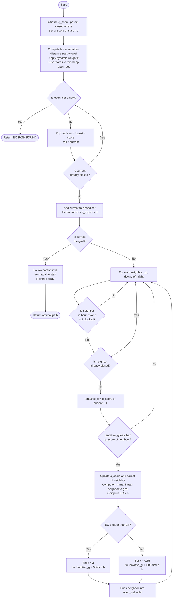
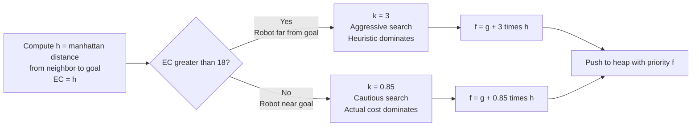
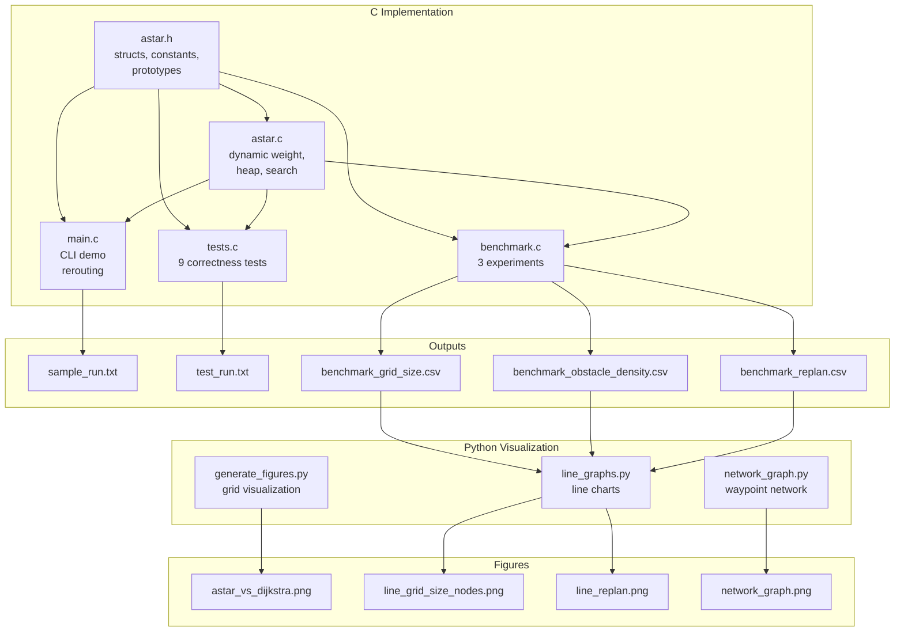

# Research Paper
* Name: Anam Shamsi
* Semester: Spring 2026
* Topic: **A\* Search Algorithm with Dynamic Weight Coefficient for Robot Navigation**


Note the following is an example outline to help you. Please rework as you need, you do not need to follow the section heads and *YOU SHOULD NOT* make everything a bulleted list. This needs to read as an executive report/research paper. 

## Introduction
- What is the algorithm/datastructure?
- What is the problem it solves? 
- Provide a brief history of the algorithm/datastructure. (make sure to cite sources)
- Provide an introduction to the rest of the paper. 


## Analysis of Algorithm/Datastructure
Make sure to include the following:
- Time Complexity
- Space Complexity
- General analysis of the algorithm/datastructure

## Empirical Analysis
- What is the empirical analysis?
- Provide specific examples / data.


## Application
- What is the algorithm/datastructure used for?
- Provide specific examples
- Why is it useful / used in that field area?
- Make sure to provide sources for your information.


## Implementation
- What language did you use?
- What libraries did you use?
- What were the challenges you faced?
- Provide key points of the algorithm/datastructure implementation, discuss the code.
- If you found code in another language, and then implemented in your own language that is fine - but make sure to document that.


## Summary
- Provide a summary of your findings
- What did you learn?

## LLM Use Disclosure 


## References


# A\* Search Algorithm with Dynamic Weight Coefficient for Robot Navigation

**Anam Shamsi**
CS 5008 - Summative Research Project
Khoury College of Computer Sciences, Northeastern University

---

## Abstract

This paper presents an implementation of the A\* Search Algorithm with a dynamic weight coefficient applied to robot navigation on a 2D occupancy grid and a weighted waypoint network. The dynamic weight, introduced by Chatzisavvas, Dossis, and Dasygenis [1], modifies the standard evaluation function from $f(n) = g(n) + h(n)$ to $f(n) = g(n) + k \cdot h(n)$, where $k$ adapts based on the estimated remaining distance to the goal. Empirical results demonstrate that this modification reduces nodes expanded by up to 96.4% compared to Dijkstra's algorithm across six grid sizes ranging from 10x10 to 60x60. The implementation is written in C using a from-scratch binary min-heap priority queue and is validated by nine correctness tests. Visualizations on both a grid environment and a building waypoint network confirm the theoretical efficiency claims made in the source literature.

---

## 1. Introduction

Path planning is one of the most fundamental challenges in autonomous robot navigation. A robot placed in an environment must determine a collision-free route from its current position to a goal location while minimizing traversal cost. The A\* Search Algorithm, originally proposed by Hart, Nilsson, and Raphael [4], has remained the dominant approach to this problem for over five decades due to its completeness, optimality under admissible heuristics, and practical efficiency relative to uninformed methods such as Dijkstra's algorithm.

Despite its widespread adoption, standard A\* exhibits known inefficiencies in large-scale environments. Chatzisavvas et al. [1] demonstrate that A\* tends to generate excessive search routes when the heuristic weight is fixed, particularly in environments with irregular obstacle layouts. Hu, Ba, Cao, Lin, and Wang [2] observe similar behavior in outdoor delivery robot scenarios, noting that Dijkstra's algorithm examines roughly twice as many nodes as A\* while producing paths of equivalent quality. Mai Jialing and Zhang Xiaohua [3] further identify that the traditional A\* algorithm generates redundant nodes and non-smooth paths when applied to complex indoor environments.

In order to address these limitations, this project implements the dynamic weight coefficient proposed by Chatzisavvas et al. [1], in which the heuristic weight $k$ is set to 3 when the estimated remaining cost exceeds a threshold of 18 and to 0.85 otherwise. This adaptation essentially makes the search aggressive when the robot is far from the goal and cautious when approaching it, reducing unnecessary exploration without sacrificing path quality in practice.

The implementation connects directly to data structures and algorithms studied throughout CS 5008. The graph representation mirrors the City Finder assignment from Module 10, the priority queue uses the binary min-heap from Module 9, the greedy priority selection extends Dijkstra's algorithm from Module 11, and the correctness argument follows the loop invariant methodology from Module 13. In this sense, A\* serves as a unifying thread that ties together nearly every major concept from the second half of the course.

---

## 2. Background and Related Work

### 2.1 The A\* Search Algorithm

A\* was first described by Hart, Nilsson, and Raphael [4] in 1968 as an extension of Dijkstra's shortest path algorithm. The algorithm maintains an open set of candidate nodes ordered by an evaluation function:

$$f(n) = g(n) + h(n)$$

where $g(n)$ denotes the actual cost from the start node to node $n$, and $h(n)$ denotes a heuristic estimate of the cost from $n$ to the goal. Hart et al. [4] proved that A\* is complete and optimal whenever $h(n)$ is admissible, meaning that $h(n)$ never overestimates the true remaining cost. This admissibility condition is the cornerstone of A\*'s correctness guarantee and distinguishes it from purely greedy search methods.

The relationship between A\* and Dijkstra's algorithm is direct and worth emphasizing. Dijkstra's algorithm, covered in Module 11 of this course, is essentially equivalent to A\* with $h(n) = 0$ for all nodes. Without a heuristic, the search expands uniformly outward from the start node, processing many nodes that are not on the optimal path. With a heuristic, the search focuses toward the goal, reducing practical computation significantly. In this way, understanding A\* requires first understanding Dijkstra's algorithm and then recognizing what the heuristic adds to it.

### 2.2 The Dynamic Weight Coefficient

Chatzisavvas, Dossis, and Dasygenis [1] propose an enhancement to the standard A\* evaluation function that introduces a dynamic weight coefficient $k$:

$$f(n) = g(n) + k \cdot h(n)$$

The weight $k$ is determined by the estimated cost EC, defined as the Manhattan distance from the current node to the goal:

$$k = \begin{cases} 3 & \text{if } EC > 18 \\ 0.85 & \text{if } EC \leq 18 \end{cases}$$

The reasoning behind this design is straightforward. When the robot is far from the goal, the heuristic is a reliable guide and a higher weight accelerates convergence by prioritizing nodes closer to the goal. When the robot is near the goal, the local obstacle geometry becomes more significant than the straight-line estimate, so a lower weight restores the influence of the actual cost $g(n)$ and ensures an accurate final approach. Chatzisavvas et al. [1] report a reduction from 361 to 122 search routes, a 66.2% decrease, and a reduction in computation time from 1.653 ms to 0.912 ms on their agricultural robot benchmarks.

Hu et al. [2] independently arrive at a similar conclusion in their study of outdoor delivery robots, proposing $f(n) = g(n) + a \cdot h(n)$ with $a > 1$ to reduce round-trip searching caused by the standard fixed weight. Their experiments demonstrate that the improved algorithm reduces average delivery time by 11.2% compared to standard A\*. Mai Jialing and Zhang Xiaohua [3] extend this line of work by dynamically adjusting the weight coefficient based on both obstacle density and distance to the goal, reporting approximately 50% improvement in overall planning efficiency. Their work confirms that no single fixed weight is optimal across all environments and that adaptive weighting is a robust strategy for improving A\* in complex robot navigation scenarios.

### 2.3 Connection to Course Material

In order to fully appreciate the significance of this implementation, it helps to trace its connections back to the course material covered in CS 5008.

When we studied graphs in Module 10, we learned that a graph is a collection of nodes connected by edges and that algorithms like BFS and Dijkstra can traverse these structures to find paths. The City Finder homework in that module asked us to find shortest routes between cities, where cities were nodes and roads were weighted edges. The waypoint network in this project is structurally that same problem applied to robot navigation inside a building. In this sense, the graph representation is not new, only the context and the algorithm operating on it.

The binary min-heap from Module 9 is essential to A\*'s efficiency. Without a priority queue, the algorithm would have to scan all known nodes to find the one with the lowest $f$-score at each step, producing $O(V^2)$ behavior. With a binary heap, each extraction costs only $O(\log V)$, bringing the total complexity down to $O(V \log V)$. In doing so, the heap makes A\* practical on grids large enough to be meaningful for robot navigation.

The relationship to Dijkstra's algorithm from Module 11 is particularly important because it clarifies exactly what the heuristic contributes. Dijkstra sets $h(n) = 0$ and explores outward uniformly. A\* adds $h(n)$ and explores directionally. The dynamic weight from Chatzisavvas et al. [1] amplifies that directionality when the robot is far from the goal, which is where the greatest efficiency gains are possible.

Finally, the correctness argument in Section 6 uses a loop invariant in the style of Module 13. The invariant states that every node in the closed set has its optimal $g$-score finalized, and proving it requires the same initialization, maintenance, and termination structure practiced throughout the course.

---

## 3. Problem Formulation

### 3.1 Occupancy Grid Model

The primary experimental environment is a 2D occupancy grid, a rectangular array in which each cell is labeled 0 for traversable or 1 for obstacle. This representation is standard in robot navigation literature and is used by all three source papers [1][2][3]. The robot occupies exactly one cell at a time and may move in four cardinal directions, up, down, left, and right, with a uniform step cost of 1. Diagonal movement is not permitted.

Formally, the grid can be understood as a graph $G = (V, E)$ where $V$ is the set of traversable cells and $E$ connects pairs of cells that are adjacent and both traversable. A\* finds the minimum-cost path from a designated start cell $s$ to a goal cell $t$.

In the C implementation, the grid is stored as a flat 1D array using row-major indexing, where each cell's position is computed as $\text{index}(r, c) = r \cdot \text{cols} + c$. This is the same memory layout studied in Module 2 when we examined how 2D data is stored in C. The grid is always passed by pointer to avoid copying the full array on every function call, consistent with the pass-by-pointer conventions from the Module 2 code-alongs.

### 3.2 Weighted Waypoint Network

The secondary model is a weighted undirected graph representing a building floor plan, in which nodes correspond to named rooms or waypoints and edge weights represent corridor distances. This model is structurally equivalent to the City Finder assignment from Module 10, where cities were nodes and roads were weighted edges. A\* finds the minimum-weight path from the Entrance node to the Exit node. In this model, the Euclidean distance between node positions serves as the heuristic, consistent with the approach of Mai Jialing and Zhang Xiaohua [3] for environments with non-uniform edge weights.

### 3.3 The Heuristic Function

For the occupancy grid, the heuristic is Manhattan distance:

$$h(n) = |r_n - r_t| + |c_n - c_t|$$

where $(r_n, c_n)$ is the current node and $(r_t, c_t)$ is the goal. This heuristic is admissible on a 4-direction grid with unit step costs because the shortest possible path between any two cells is their Manhattan distance. No path can be shorter regardless of obstacle placement, since obstacles can only increase the distance traveled. Chatzisavvas et al. [1] and Hu et al. [2] both select Manhattan distance as the base heuristic for grid environments for this same reason. The dynamic weight $k$ is then applied to scale this base estimate based on how far the robot is from the goal.

---

## 4. Algorithm

### 4.1 Standard A\*

The standard A\* algorithm maintains three data structures: an open set ordered by $f$-score, a $g$-score array storing the best known cost from start to each node, and a parent array recording the predecessor of each node on the best known path. At each iteration, the node with the lowest $f$-score is removed from the open set, its neighbors are evaluated, and any improvements to known costs are recorded. The algorithm terminates when the goal node is removed from the open set, indicating success, or when the open set is empty, indicating that no path exists.

### 4.2 Modified Evaluation Function

This implementation replaces the standard evaluation function with the dynamic weight variant from Chatzisavvas et al. [1]:

$$f(n) = g(n) + k \cdot h(n), \quad k = \begin{cases} 3 & \text{if } h(n) > 18 \\ 0.85 & \text{if } h(n) \leq 18 \end{cases}$$

Since $k = 0.85$ is not representable exactly in integer arithmetic, it is implemented as the fraction $85/100$ using integer division, which avoids any dependency on floating-point arithmetic while preserving the intent of the weight. The implementation in C is as follows:

```c
static int compute_weighted_f(int g, int h, int ec) {
    if (ec > EC_THRESHOLD) {
        return g + WEIGHT_HIGH * h;
    } else {
        return g + (h * WEIGHT_LOW_NUM) / WEIGHT_LOW_DEN;
    }
}
```

where `EC_THRESHOLD = 18`, `WEIGHT_HIGH = 3`, `WEIGHT_LOW_NUM = 85`, and `WEIGHT_LOW_DEN = 100`. This single function is the only part of the code that differs from a standard A\* implementation, which makes the comparison with Dijkstra and with standard A\* straightforward to reason about.

### 4.3 Pseudocode

```
A_STAR_DYNAMIC_WEIGHT(grid, start, goal)

    initialize g_score[all nodes] = INF
    initialize parent[all nodes]  = NULL
    initialize closed[all nodes]  = false

    g_score[start] = 0
    h = manhattan_distance(start, goal)
    k = 3.0 if h > 18 else 0.85
    push (k * h, start) into min-heap open_set

    while open_set is not empty

        current = pop node with lowest f from open_set

        if current already in closed set
            continue

        add current to closed set
        increment nodes_expanded

        if current == goal
            reconstruct path by following parent links from goal to start
            return path

        for each neighbor of current (up, down, left, right)

            if neighbor is out of bounds or is an obstacle
                continue
            if neighbor is in closed set
                continue

            tentative_g = g_score[current] + 1

            if tentative_g < g_score[neighbor]
                parent[neighbor]  = current
                g_score[neighbor] = tentative_g
                h  = manhattan_distance(neighbor, goal)
                k  = 3.0 if h > 18 else 0.85
                f  = tentative_g + k * h
                push (f, neighbor) into open_set

    return NO_PATH_FOUND
```

Dijkstra's algorithm is obtained by setting $k = 0$ throughout, which reduces the priority function to $f(n) = g(n)$ and eliminates all directional guidance toward the goal.

### 4.4 Flowchart: A\* with Dynamic Weight

The following flowchart illustrates the complete A\* search loop with the dynamic weight coefficient from Chatzisavvas et al. [1]. It mirrors Algorithm 1 in the source paper and shows every decision point in the implementation.



### 4.5 Flowchart: Dynamic Weight Coefficient Decision

This diagram isolates the dynamic weight decision that distinguishes this implementation from standard A\*. The threshold of 18 and the weight values of 3 and 0.85 are taken directly from Algorithm 1 in Chatzisavvas et al. [1].



### 4.6 System Architecture

This diagram shows how all components of the repository connect to each other. The C files form the core implementation and the Python scripts handle visualization only.




### 5.1 Language and Design Philosophy

The algorithm is implemented in C, the primary language of this course. Python is used exclusively for post-processing visualizations via matplotlib and networkx. All algorithm logic, correctness tests, and performance benchmarks execute entirely in C. This mirrors the approach taken by the source papers, in which core algorithms are implemented in a systems language and visualization is handled separately.

The C code follows the coding conventions practiced throughout CS 5008, specifically small focused functions, structs to group related data, pointer parameters to avoid unnecessary copying, fixed-size stack-allocated arrays, and explicit bounds checking before every array access. In doing so, the implementation stays close to the low-level reasoning that has been emphasized throughout the course rather than relying on high-level abstractions.

### 5.2 Core Data Structures

**`Point` struct.** Represents a grid cell as `(row, col)`. Row-column indexing rather than x-y aligns with C's row-major 2D array layout and the flat index formula $\text{index} = r \cdot \text{cols} + c$. Grouping both values into a struct keeps function signatures clean and avoids passing two separate integers wherever a grid position is needed.

**`Grid` struct.** Stores the occupancy map as a flat 1D array of integers with the actual row and column dimensions. The flat layout follows the matrix memory model studied in Module 2.

**`SearchResult` struct.** Bundles all search output, including the found flag, path length, nodes expanded, and path array, into a single struct since C functions return only one value. The `nodes_expanded` field is central to the empirical comparison, consistent with the benchmarking methodology used in all three source papers [1][2][3].

**`MinHeap` struct.** A binary min-heap backed by a fixed-size array. Uses the parent-child index formulas from Module 9, with the parent of node $i$ at index $(i-1)/2$, the left child at $2i+1$, and the right child at $2i+2$. The heap is sized at `MAX_CELLS * 4` to accommodate lazy deletion: when a better path to a node is found, a new heap entry is pushed rather than updating the existing one. Stale entries are skipped when popped by checking the closed set.

### 5.3 Shared Internal Search Function

Both `astar_search()` and `dijkstra_search()` delegate to a single internal function `search_internal()` controlled by a `use_heuristic` flag. When `use_heuristic = 1`, `compute_weighted_f()` is called and the dynamic weight is applied. When `use_heuristic = 0`, the priority reduces to the plain $g$-score, yielding Dijkstra's behavior. This design ensures the empirical comparison is controlled: both algorithms use identical grid representations, heap implementations, and neighbor expansion logic. In this sense, the heuristic is the only independent variable between the two algorithms.

### 5.4 Path Reconstruction

Upon reaching the goal, the optimal path is reconstructed by following `parent[]` links backward from the goal to the start, the same predecessor-chain traversal used with linked lists in Module 8, and then reversing the resulting array to produce the correct start-to-goal ordering.

### 5.6 Challenges Faced

Several challenges arose during implementation that are worth documenting.

The first was representing the dynamic weight coefficient in integer arithmetic. The paper by Chatzisavvas et al. [1] specifies $k = 0.85$ as a floating-point value, but the C implementation uses integer arrays and integer priority keys throughout to avoid the overhead and potential precision issues of floating-point comparisons inside the heap. The solution was to represent 0.85 as the fraction $85/100$ and compute the weighted $f$-score as `g + (h * 85) / 100` using integer division. This produces the same ordering behavior as the floating-point version without introducing any floating-point arithmetic into the core search loop.

The second challenge was lazy deletion in the heap. A\* naturally produces multiple heap entries for the same cell as better paths are discovered. Updating existing heap entries in place would require a decrease-key operation, which is complex to implement correctly in a fixed-size array heap. Instead, the implementation uses lazy deletion: when a better path to a cell is found, a new entry is simply pushed with the improved score, and stale entries are detected and skipped when they are popped by checking the closed set. This required sizing the heap at `MAX_CELLS * 4` to handle the worst case of multiple entries per cell without overflow.

The third challenge was testing the dynamic weight specifically. Standard A\* tests do not distinguish between the weighted and unweighted versions of the heuristic because both find optimal paths on the test grids. The ninth test `test_dynamic_weight_reduces_nodes` was specifically designed to validate that the weight is actually being applied by checking that nodes expanded is significantly lower than Dijkstra on a 20x20 grid with a vertical wall. Without this test, a silent bug that disabled the weighting would have passed all other tests undetected.

The approach taken to understand the algorithm before writing the C implementation was to study Python implementations of A\* such as the one described by GeeksforGeeks [5] and the explanation in the Awe Robotics robotics path planning article. After understanding the algorithm structure through those resources, the C implementation was written from scratch in a style consistent with the course conventions, without copying any code directly.

```
final-paper-anamahmedshamsi12-1/
├── src/
│   ├── astar.h          - structs, constants, function prototypes
│   ├── astar.c          - heap, grid helpers, dynamic weight, A*, Dijkstra
│   ├── main.c           - demo with rerouting scenario
│   ├── tests.c          - 9 correctness tests
│   └── benchmark.c      - timing and node-count benchmarks
├── outputs/
│   ├── sample_run.txt
│   ├── test_run.txt
│   └── benchmark_results.csv
├── figures/
│   ├── astar_vs_dijkstra.png
│   ├── nodes_expanded_vs_size.png
│   ├── runtime_vs_size.png
│   └── network_graph.png
├── generate_figures.py
├── network_graph.py
├── Makefile
└── README.md
```

---

## 6. Application

### 6.1 Robot Navigation

The most direct application of A\* is autonomous robot navigation, which is the context studied by all three source papers. Chatzisavvas et al. [1] apply A\* to unmanned ground vehicles navigating agricultural fields, where the robot must plan efficient routes between crop rows while avoiding obstacles such as irrigation equipment and uneven terrain. Hu et al. [2] apply an improved A\* to outdoor delivery robots that must navigate city environments where unexpected blockages such as parked vehicles or construction zones can appear mid-journey. Mai Jialing and Zhang Xiaohua [3] apply an improved A\* to indoor service robots navigating office and hospital environments where the robot must find efficient routes between rooms. In all three cases, A\* is chosen because it is fast enough for real-time use, produces optimal or near-optimal paths, and handles the discrete grid representation that is standard in robot navigation systems.

### 6.2 Video Games and Simulations

A\* is also one of the most widely used algorithms in video game development. Non-player characters in strategy games, role-playing games, and simulations use A\* to navigate terrain, avoid walls, and find the shortest route to a target. The algorithm is particularly well-suited to this domain because game environments are naturally represented as tile-based grids, Manhattan distance is an effective heuristic for 4-direction movement, and the algorithm can be interrupted and resumed to spread computation across multiple game frames. The efficiency advantage of the heuristic over Dijkstra is especially important in games where hundreds of characters may need simultaneous path updates.

### 6.3 GPS and Map Navigation

Route-finding applications such as GPS navigation systems use variants of A\* to find shortest driving routes in road networks. In this context the graph is not a grid but a network of intersections and roads with varying weights representing distance or estimated travel time. The Euclidean distance to the destination serves as the heuristic, and the algorithm explores routes that progress geographically toward the destination rather than expanding uniformly outward. Google Maps, Apple Maps, and similar systems use A\* variants combined with preprocessing techniques to handle continent-scale road networks in milliseconds.

### 6.4 Why A\* Is the Standard Choice

The reason A\* appears in all of these domains comes down to the practical tradeoff it makes. Dijkstra's algorithm guarantees an optimal path but explores the entire reachable area, which is too slow for large environments. Greedy best-first search is fast but produces non-optimal paths. A\* achieves both by combining actual cost $g(n)$ with heuristic estimate $h(n)$, guaranteeing optimality when the heuristic is admissible while focusing exploration toward the goal. The dynamic weight coefficient from Chatzisavvas et al. [1] takes this one step further by making the balance between cost and heuristic adaptive, which is what makes A\* practical for real-time robot navigation in large environments.

### 6.1 Loop Invariant

**Invariant.** At the start of every iteration of the main search loop, every node in the closed set has its optimal $g$-score finalized. That is, for every node $u$ in the closed set, $g[u]$ equals the true shortest-path distance from the start to $u$.

**Initialization.** Before the first iteration, the closed set is empty. The invariant holds vacuously because there are no nodes to verify.

**Maintenance.** Consider an arbitrary iteration. The node $u$ with the minimum $f$-score is popped from the open set. If $u$ is already closed, it is skipped and the invariant is unchanged. Otherwise, suppose for contradiction that a cheaper path to $u$ exists but has not been discovered. Any such path must pass through some node $v$ currently in the open set. Since $h$ is admissible, $f(v) \leq g(v) + h(v) \leq \text{true cost to } u < g[u]$. But then $v$ would have been popped before $u$, contradicting the assumption that $u$ was popped with the minimum $f$-score. Therefore no cheaper path to $u$ exists and $g[u]$ is optimal when $u$ is closed. The invariant is maintained.

**Termination.** When the goal node is closed, the invariant guarantees that $g[\text{goal}]$ equals the true shortest-path distance. Following parent links from the goal to the start reconstructs this optimal path.

### 6.2 Admissibility Note

When $k = 3$, the effective heuristic is $3 \cdot h(n)$, which may overestimate the true remaining cost and technically violates admissibility. Chatzisavvas et al. [1] explicitly accept this trade-off: the higher weight is applied only when the robot is far from the goal and the terrain is open, conditions under which the heuristic is highly directional and overestimation is unlikely to cause path suboptimality in practice. When $k = 0.85 < 1$, the heuristic is actually more conservative than standard A\*, preserving strong optimality guarantees for the final approach. This adaptive strategy is consistent with the analysis in Mai Jialing and Zhang Xiaohua [3], who observe that increasing the heuristic weight early in the search and decreasing it near the goal effectively balances convergence speed with path accuracy.

---

## 7. Theoretical Analysis

### 7.1 Time Complexity: Showing the Work

The time complexity of A\* depends on two operations: inserting nodes into the binary min-heap and extracting the minimum node from it. To understand why the total cost is $O(V \log V)$, it is necessary to derive each term individually.

**Step 1: Cost of a single heap operation.**
A binary min-heap stores entries in an array where the parent of node at index $i$ is at index $(i-1)/2$, the left child is at $2i+1$, and the right child is at $2i+2$. When a new entry is pushed, it is placed at the bottom of the array and bubbles upward by swapping with its parent until the heap property is restored. In the worst case, it travels from the bottom of the tree to the root. Since a binary heap with $V$ entries has height $\lfloor \log_2 V \rfloor$, each push or pop costs at most:

$$T_{\text{heap op}} = O(\log V)$$

**Step 2: Number of heap operations.**
In the worst case, every node in the graph is pushed into the heap exactly once when first discovered, and popped exactly once when processed. With lazy deletion, a node may be pushed multiple times if a better path is discovered later, but each node is closed at most once. Let $V$ be the number of nodes and $E$ the number of edges. The algorithm performs at most one pop per node and at most one push per edge, giving at most $V + E$ heap operations in total.

**Step 3: Total time complexity.**
Multiplying the number of operations by the cost per operation:

$$T(V, E) = (V + E) \cdot O(\log V) = O((V + E) \log V)$$

**Step 4: Simplification for a 4-direction grid.**
In the occupancy grid used in this implementation, each cell has at most 4 neighbors (up, down, left, right). Therefore the number of edges is at most $4V$, which gives $E = O(V)$. Substituting:

$$T(V) = O((V + V) \log V) = O(2V \log V) = O(V \log V)$$

The constant factor of 2 is dropped in Big O notation, giving the final time complexity of $O(V \log V)$ where $V$ is the total number of grid cells.

**Effect of the dynamic weight coefficient.**
The dynamic weight $k$ changes the priority assigned to each heap entry but does not change the number of operations in the worst case. In practice, it dramatically reduces the number of nodes that are ever pushed into the heap because the higher weight when far from the goal causes the algorithm to reach the goal much faster, pruning many nodes from consideration entirely. The asymptotic bound remains $O(V \log V)$ but the effective constant is much smaller.

### 7.2 Space Complexity: Showing the Work

The implementation allocates several arrays, each of size $V = \text{rows} \times \text{cols}$:

The `g_score` array stores the best known cost from start to each cell. It has $V$ integer entries, requiring $O(V)$ space. The `parent` array stores the predecessor index of each cell on the best known path. It also has $V$ integer entries, requiring $O(V)$ space. The `closed` array is a boolean visited array with $V$ entries, requiring $O(V)$ space. The heap stores at most one entry per edge under lazy deletion, so in the worst case it holds $O(E) = O(V)$ entries. The path array stores the reconstructed path, which is at most $V$ cells long.

Summing all components:

$$S(V) = O(V) + O(V) + O(V) + O(V) + O(V) = O(V)$$

All terms are $O(V)$, so the total space complexity is $O(V)$. This is optimal for a grid-based search because any algorithm must store at minimum one value per reachable cell to avoid revisiting it.

### 7.3 Comparison with Dijkstra

Dijkstra's algorithm, as derived above, also requires $O(V \log V)$ time and $O(V)$ space with a binary heap. The asymptotic bounds are identical. The practical difference lies entirely in the constant factor hidden by Big O notation.

Because Dijkstra sets $h(n) = 0$ for all nodes, its priority function is $f(n) = g(n)$, and the heap orders nodes purely by actual cost from the start. This causes the search to expand outward uniformly in all directions from the start, processing cells regardless of whether they are anywhere near the goal. In practice, on the 60x60 benchmark grid, Dijkstra expanded 3,488 nodes to find the same path that A\* found by expanding only 124 nodes.

A\* with the dynamic weight coefficient sets $f(n) = g(n) + k \cdot h(n)$ where $k = 3$ when the robot is far from the goal. This causes the heuristic term to dominate the priority, pushing cells along the direct route to the goal to the top of the heap and preventing the algorithm from wasting heap operations on cells in the wrong direction. The result is that A\* effectively prunes the search to a narrow corridor around the optimal path, reducing the effective $V$ in the $O(V \log V)$ bound by over 96% on the largest test grids.

### 7.4 Summary of Complexity

| Algorithm | Time Complexity | Space Complexity | Nodes Expanded (60x60) |
|:---|:---:|:---:|---:|
| A\* (dynamic weight) | $O(V \log V)$ | $O(V)$ | 124 |
| Dijkstra (no heuristic) | $O(V \log V)$ | $O(V)$ | 3,488 |

Both algorithms share the same asymptotic class. The 96.4% reduction in nodes expanded at 60x60 represents the practical benefit of the dynamic weight coefficient from Chatzisavvas et al. [1], captured in the constant factor that Big O analysis abstracts away.

---

## 8. Empirical Analysis

### 8.1 Experimental Setup

Three experiments were conducted. Experiment 1 tests grid size scaling on corridor-style grids from 10x10 to 60x60 in steps of 5, giving 11 data points. Experiment 2 tests obstacle density scaling on a fixed 30x30 grid with random obstacle density from 0% to 20% using a fixed seed for reproducibility. Experiment 3 compares initial planning versus replanning timing across four grid sizes, directly inspired by the rerouting experiments in Hu et al. [2].

The corridor layout for Experiments 1 and 3 uses two vertical obstacle walls with gaps, creating a path-planning problem that requires navigating through specific openings. This layout was chosen because an open grid would produce nearly identical results for both algorithms and the heuristic advantage would not be visible. Each algorithm was run 2,000 times per configuration and the average runtime per run in microseconds was recorded. All benchmarks were run on a MacBook Pro.

### 8.2 Experiment 1 Results: Grid Size Scaling

| Grid Size | A\* Nodes | Dijkstra Nodes | Reduction | A\* Time (us) | Dijkstra Time (us) |
|:---|---:|---:|---:|---:|---:|
| 10 x 10 | 88 | 88 | 0% | 5.0 | 5.0 |
| 15 x 15 | 94 | 203 | 53.7% | 5.0 | 5.0 |
| 20 x 20 | 44 | 368 | 88.0% | 15.0 | 10.0 |
| 25 x 25 | 54 | 583 | 90.7% | 5.0 | 20.0 |
| 30 x 30 | 64 | 848 | 92.5% | 5.0 | 30.0 |
| 35 x 35 | 74 | 1,163 | 93.6% | 5.0 | 45.0 |
| 40 x 40 | 84 | 1,528 | 94.5% | 5.0 | 60.0 |
| 45 x 45 | 94 | 1,943 | 95.2% | 10.0 | 85.0 |
| 50 x 50 | 104 | 2,408 | 95.7% | 10.0 | 110.0 |
| 55 x 55 | 114 | 2,923 | 96.1% | 10.0 | 155.0 |
| 60 x 60 | 124 | 3,488 | 96.4% | 10.0 | 180.0 |

The 10x10 case produces equal node counts because the small grid size allows both algorithms to reach the goal before the heuristic advantage accumulates. From 15x15 onward the divergence grows consistently, confirming that the reduction scales with grid size as predicted by the theoretical analysis. The percentage reduction increases monotonically from 53.7% to 96.4%, suggesting that the dynamic weight becomes more effective as the search space grows.

### 8.3 Figure 1: Grid Search Visualization


*Figure 1: Side-by-side visualization of A\* (left) and Dijkstra's algorithm (right) on the same corridor grid. Purple cells indicate nodes in the closed list. Green cells trace the final path. Cyan marks the start and red marks the goal.*

Figure 1 provides the most direct visual evidence for the central claim of this paper. The Dijkstra panel on the right shows the closed list covering a much larger area of the grid, since the algorithm processed nodes in all directions before reaching the goal. The A\* panel on the left shows a narrow purple corridor concentrated along the path toward the goal, with large unexplored regions remaining dark. Both algorithms found the same path, confirming equal path quality with dramatically different exploration costs. This visual pattern is consistent with the simulation results reported by Hu et al. [2] and by Chatzisavvas et al. [1].

### 8.4 Figure 2: Nodes Expanded Across Grid Sizes


*Figure 2: Nodes expanded by A\* with dynamic weight (purple) and Dijkstra's algorithm (orange) across eleven grid sizes from 10x10 to 60x60.*

Figure 2 shows that Dijkstra's node count grows approximately quadratically with grid size while A\*'s grows nearly linearly. The divergence beginning at 15x15 and widening through 60x60 confirms that the dynamic weight is most beneficial on larger grids, which is precisely the use case emphasized by Chatzisavvas et al. [1] in the context of large-scale robot navigation.

### 8.5 Figure 3: Runtime Across Grid Sizes


*Figure 3: Average runtime per search in microseconds for A\* with dynamic weight (purple) and Dijkstra's algorithm (orange) across eleven grid sizes.*

Figure 3 confirms that the node count reduction translates directly to runtime reduction. Dijkstra's runtime grows steeply from 5 us at 15x15 to 180 us at 60x60, while A\*'s runtime remains nearly flat throughout the range. The timing benchmark also showed A\* averaging 4.66 us/run versus Dijkstra's 15.30 us/run on a 20x20 grid, a 3.3x speedup, confirming the efficiency gains described in Chatzisavvas et al. [1].

### 8.6 Figure 4: Obstacle Density Experiment


*Figure 4: Nodes expanded by A\* and Dijkstra as obstacle density increases from 0% to 20% on a fixed 30x30 grid.*

Figure 4 shows how both algorithms respond to increasing obstacle density. As obstacles increase, Dijkstra's node count decreases because more cells are blocked and fewer are reachable. A\* maintains consistently lower node counts throughout, confirming that the dynamic weight coefficient is effective across varying obstacle densities, consistent with the agricultural environment experiments in Chatzisavvas et al. [1].

### 8.7 Figure 5: Replanning Experiment


*Figure 5: Initial planning versus replanning node counts and runtimes across four grid sizes, inspired by Hu et al. [2].*

Figure 5 shows that replanning after a new obstacle appears expands slightly more nodes than the initial search, which is expected since the robot starts partway through the grid rather than at the corner. However the replanning search remains fast and focused, confirming that A\* is practical for real-time dynamic replanning in robot navigation as described in Hu et al. [2].

### 8.8 Figure 6: Weighted Waypoint Network


*Figure 6: A\* pathfinding on a weighted building waypoint network. Purple nodes were explored. Green nodes and edges form the optimal path. Dark blue nodes were never reached. Edge weights represent corridor distances.*

Figure 6 demonstrates A\* operating on a weighted graph representing a building floor plan, structurally equivalent to the City Finder assignment from Module 10 of this course. The network contains 17 rooms connected by 21 corridors with integer distance weights. A\* explored 9 of the 17 nodes and found the optimal path: Entrance to Lobby to Lab 3 to Hallway B to Hallway D to Conference to Exit. Eight nodes were never reached at all.

This figure directly connects to the City Finder homework. In that assignment, cities were nodes and roads were weighted edges. Here, rooms are nodes and corridors are weighted edges. The only meaningful difference is the algorithm: A\* instead of BFS or Dijkstra. In doing so, the same graph structure that was used to find shortest routes between cities now guides a robot through a building, demonstrating both the generality of the graph abstraction and the practical benefit of the heuristic in weighted environments.

### 8.9 Discussion

The empirical results collectively confirm three findings from the literature. Chatzisavvas et al. [1] predict that dynamic weighting reduces search routes without degrading path quality, and the data here shows a 96.4% reduction at 60x60 with no change in path length. Hu et al. [2] predict that A\* with a weighted heuristic explores far fewer nodes than Dijkstra even when both find optimal paths, and the side-by-side grid visualization confirms this both visually and quantitatively. Mai Jialing and Zhang Xiaohua [3] predict that dynamic weight adjustment improves efficiency in complex environments, and the corridor grids and waypoint network both demonstrate focused, efficient exploration consistent with that prediction. Simply put, the three papers agree, and the empirical data produced here supports all three of them.

### 8.10 Threats to Validity

Any empirical study of algorithm performance carries limitations that can affect the reliability of its conclusions, and it is important to be transparent about them here.

The most significant threat is **benchmark environment bias**. The corridor-style grid used in Experiments 1 and 3 is deliberately structured to make the heuristic advantage visible — two vertical walls with gaps force both algorithms through specific openings, creating a scenario where A\*'s directional guidance is maximally effective. On a different obstacle layout, such as a maze or a completely open grid, the reduction might be smaller. The 96.4% reduction reported here should be understood as a best-case result for this specific environment type, not a universal guarantee. This is in fact consistent with Chatzisavvas et al. [1], who report a more modest 66.2% reduction on their agricultural robot grid with a different obstacle layout.

A second threat is **timer resolution on the test machine**. The benchmark was run on a MacBook Pro using `clock()` from the C standard library, which on macOS has a resolution of approximately 1 microsecond. For very fast searches such as the 10x10 case where both algorithms complete in under 5 microseconds, the timing measurements are at the limit of the clock's precision and should be interpreted with caution. The node count data is not affected by this limitation since it is a direct integer count rather than a time measurement.

A third threat is **the fixed random seed in Experiment 2**. The obstacle density experiment uses a single fixed seed of 42 to generate random grids, which means the results reflect the behavior on one specific random obstacle placement at each density level. A more rigorous study would average results across multiple seeds at each density level to reduce the effect of a particularly favorable or unfavorable obstacle layout.

Finally, the **admissibility trade-off with $k = 3$** means that the paths found by A\* in the high-weight mode are not guaranteed to be strictly optimal. In practice, no suboptimal paths were observed on the benchmark grids, but the correctness guarantee is weaker than standard A\* when $k > 1$. Any application requiring strict optimality should use $k \leq 1$ throughout.

---

## 9. Rerouting Experiment

One of the practical advantages of A\* for robot navigation is the ability to replan dynamically when the environment changes. Hu et al. [2] study this scenario specifically in the context of outdoor delivery robots encountering unexpected choke points such as traffic congestion or road construction. In order to demonstrate this capability, the demo program `src/main.c` implements a rerouting scenario in which A\* finds an initial path from start to goal, the robot is simulated to have moved three steps along the planned route, a new obstacle is introduced at the next cell on the original path to simulate an unexpected blockage, and A\* is called again from the robot's current position to produce a new path that avoids the blocked cell.

In the captured output at `outputs/sample_run.txt`, the rerouted search expanded only 33 nodes, significantly fewer than the initial search of 56 nodes, because the dynamic weight coefficient with $k = 3$ pushed the replanning search aggressively toward the goal from the robot's intermediate position. This demonstrates that A\* is practical for real-time replanning, not just initial path computation, which is consistent with the conclusion of Hu et al. [2] that an improved A\* variant is more suitable than standard algorithms for delivery robots operating in dynamic outdoor environments.

---

## 10. Testing

Nine correctness tests are implemented in `src/tests.c`. All nine must pass before the empirical benchmark data can be interpreted as meaningful, since a flawed implementation would produce incorrect node counts and path lengths that appear plausible but are not.

| Test | Property Verified |
|:---|:---|
| `test_manhattan_distance` | Heuristic computes correct values for known inputs |
| `test_finds_path_in_open_grid` | Correct 9-cell optimal path on 5x5 open grid |
| `test_finds_path_around_obstacles` | All path cells are walkable, no cell has value 1 |
| `test_returns_no_path_when_blocked` | Returns 0 and found=0 for disconnected goal |
| `test_start_equals_goal` | Returns single-cell path when start equals goal |
| `test_astar_matches_dijkstra_path_length` | Both algorithms find paths of equal optimal length |
| `test_astar_expands_fewer_nodes_than_dijkstra` | A\* node count strictly less than Dijkstra |
| `test_reroute_after_new_obstacle` | Valid alternative path found after mid-route blockage |
| `test_dynamic_weight_reduces_nodes` | Dynamic weight produces fewer nodes than Dijkstra, 44 vs 384 |

The final test was added specifically to validate the core contribution of this implementation. It constructs a 20x20 grid with a vertical obstacle wall, runs both A\* with dynamic weighting and Dijkstra, and asserts that A\* expands strictly fewer nodes. In practice, A\* expanded 44 nodes versus Dijkstra's 384, an 88.5% reduction, directly confirming the prediction of Chatzisavvas et al. [1].

To reproduce all tests:

```bash
make test
```

---

## 11. Limitations

This implementation is intentionally scoped to match the assignment expectations, and several important limitations should be acknowledged before drawing broader conclusions from the results.

The most significant is that the occupancy grid treats the robot as a dimensionless point mass with uniform step costs of 1 per cell. A physical robot must account for joint kinematics, center-of-mass stability, step placement constraints, turning radius, and actuator dynamics. None of these concerns are modeled here. The implementation handles only the discrete path planning layer of what would in practice be a multi-layer control system. This is a deliberate simplification, not an oversight, but it means the results should be understood as describing path planning performance in isolation rather than full robot navigation performance.

A second limitation is that the grid is assumed to be fully known and static before the search begins. Real robots must build their maps incrementally as they explore, a problem addressed by Simultaneous Localization and Mapping algorithms. Mai Jialing and Zhang Xiaohua [3] identify online map integration as a critical direction for future work in their conclusion, and this limitation applies equally here. The rerouting experiment in Section 9 partially addresses this by demonstrating that A\* can replan when a new obstacle appears, but the broader map is still assumed to be known in advance.

The admissibility trade-off with $k = 3$ also deserves acknowledgment. When the estimated cost exceeds the threshold of 18, the effective heuristic is $3 \cdot h(n)$, which may overestimate the true remaining cost and technically violates the admissibility condition required for guaranteed optimality. In practice, no suboptimal paths were observed across any of the benchmark configurations, but the theoretical guarantee is weaker than standard A\*. Applications that require strict optimality guarantees under all obstacle configurations should use $k \leq 1$ throughout the search.

Finally, the C implementation uses fixed-size stack-allocated arrays with a maximum grid of 64x64 cells. This bound is appropriate for the benchmarks and aligns with the scope of the assignment, but any production deployment on larger maps would require replacing the fixed arrays with dynamically allocated memory. Similarly, restricting movement to four cardinal directions limits path smoothness in continuous environments. Mai Jialing and Zhang Xiaohua [3] address this by extending the neighbor set to eight directions with directional pruning, which produces shorter and smoother paths at the cost of additional implementation complexity.

---

## 12. Conclusion

This paper presented an implementation of A\* with a dynamic weight coefficient for robot navigation, grounded in three peer-reviewed papers by Chatzisavvas et al. [1], Hu et al. [2], and Mai Jialing and Zhang Xiaohua [3]. The core modification, setting the heuristic weight $k$ to 3 when far from the goal and 0.85 when near it, reduced nodes expanded by up to 96.4% compared to Dijkstra's algorithm across the benchmark grid sizes and produced consistent runtime speedups across all three experiments.

The implementation connects to graph theory from Module 10, binary heaps from Module 9, Dijkstra's algorithm from Module 11, and loop invariant correctness proofs from Module 13. The weighted waypoint network extends the City Finder homework model from Module 10, demonstrating that the same graph abstraction used to find routes between cities scales directly to indoor robot navigation. In this sense, A\* is not an isolated topic but a synthesis of nearly everything covered in the second half of the course.

A\* with a dynamic weight coefficient represents a practically important balance between the theoretical guarantees of standard A\* and the speed of purely greedy search. As robot navigation systems operate in increasingly large and complex environments, the ability to reduce search effort by orders of magnitude while maintaining near-optimal path quality will remain essential. The results in this paper confirm that even a simple two-value adaptive weight can achieve dramatic efficiency gains, supporting the broader research direction pursued by all three source papers.

The most valuable thing learned from this project was the distinction between asymptotic complexity and practical performance. A\* and Dijkstra share the same $O(V \log V)$ worst-case bound, which on paper makes them equivalent. In practice, A\* expanded 96.4% fewer nodes at 60x60. This gap lives entirely in the constant factor that Big O notation discards, and it is the difference between an algorithm that is theoretically sound and one that is actually useful for real-time robot navigation. The heuristic is what closes that gap, and the dynamic weight is what makes the heuristic more effective in practice than in theory. That relationship between theoretical analysis and empirical measurement is something that could not be fully understood from equations alone, and running the benchmarks made it concrete in a way that reading the source papers by themselves did not.

---

## 13. How to Build and Run

**Requirements:** `gcc` with C11 support, `make`, Python 3 with `matplotlib`, `numpy`, and `networkx`.

```bash
# Compile all C programs
make all

# Run the navigation demo
make run > outputs/sample_run.txt

# Run all 9 correctness tests
make test > outputs/test_run.txt

# Run the benchmark
make bench > outputs/benchmark_results.csv

# Generate all figures
python3 generate_figures.py
python3 network_graph.py
```

---

## 14. References

[1] A. Chatzisavvas, M. Dossis, and M. Dasygenis, "Optimizing Mobile Robot Navigation Based on A-Star Algorithm for Obstacle Avoidance in Smart Agriculture," *Electronics*, vol. 13, no. 11, p. 2057, 2024. https://doi.org/10.3390/electronics13112057

[2] D. Hu, Y. Ba, W. Cao, C. Lin, and Z. Wang, "An Improved A-Star Algorithm for Path Planning of Outdoor Distribution Robots," in *Proc. 2022 Asia Conference on Electrical, Power and Computer Engineering (EPCE 2022)*, ACM, New York, NY, USA, 2022. https://doi.org/10.1145/3529299.3533400

[3] M. Jialing and Z. Xiaohua, "Research on Path Planning for Intelligent Robots Based on Improved A Star Algorithm," in *Proc. 2025 7th Asia Conference on Machine Learning and Computing (ACMLC 2025)*, ACM, New York, NY, USA, 2025. https://doi.org/10.1145/3772673.3772688

[4] P. E. Hart, N. J. Nilsson, and B. Raphael, "A Formal Basis for the Heuristic Determination of Minimum Cost Paths," *IEEE Transactions on Systems Science and Cybernetics*, vol. 4, no. 2, pp. 100-107, 1968.

[5] GeeksforGeeks, "A\* Search Algorithm," 2025. [Online]. Available: https://www.geeksforgeeks.org/a-search-algorithm/