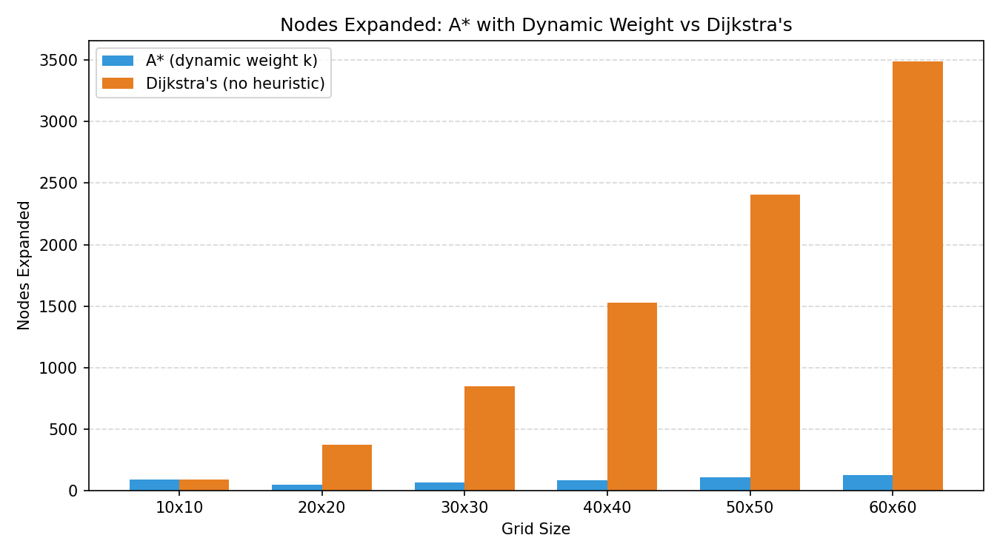
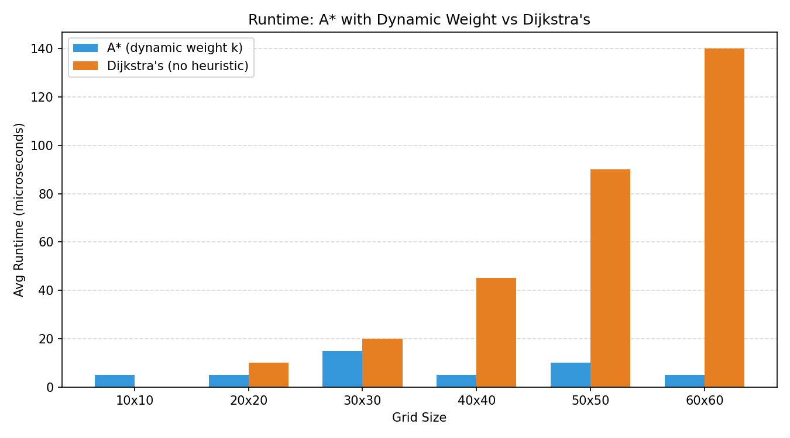

# Research Paper
* Name: Anam Shamsi
* Semester: Spring 2026
* Topic: 


Note the following is an example outline to help you. Please rework as you need, you do not need to follow the section heads and *YOU SHOULD NOT* make everything a bulleted list. This needs to read as an executive report/research paper. 

## Introduction
- What is the algorithm/datastructure?
- What is the problem it solves? 
- Provide a brief history of the algorithm/datastructure. (make sure to cite sources)
- Provide an introduction to the rest of the paper. 


## Analysis of Algorithm/Datastructure
Make sure to include the following:
- Time Complexity
- Space Complexity
- General analysis of the algorithm/datastructure

## Empirical Analysis
- What is the empirical analysis?
- Provide specific examples / data.


## Application
- What is the algorithm/datastructure used for?
- Provide specific examples
- Why is it useful / used in that field area?
- Make sure to provide sources for your information.


## Implementation
- What language did you use?
- What libraries did you use?
- What were the challenges you faced?
- Provide key points of the algorithm/datastructure implementation, discuss the code.
- If you found code in another language, and then implemented in your own language that is fine - but make sure to document that.


## Summary
- Provide a summary of your findings
- What did you learn?

## LLM Use Disclosure 


## References


# A\* Search Algorithm for Robot Navigation

## Author
Anam Shamsi
CS 5008 — Summative Research Project

---

## 1. Introduction

This project implements the A\* Search Algorithm in C and applies it to robot navigation on both a 2D occupancy grid and a weighted waypoint network. The core idea is that a robot needs to find the shortest collision-free path from a starting location to a goal location in an environment that contains obstacles such as walls, furniture, or restricted zones.

What makes this implementation different from a standard A\* is the inclusion of a **dynamic weight coefficient** on the heuristic function, taken directly from the research by Chatzisavvas et al. [1]. In standard A\*, the evaluation function is:

$$f(n) = g(n) + h(n)$$

This implementation uses:

$$f(n) = g(n) + k \cdot h(n)$$

where $k$ is chosen dynamically based on how far the robot is from the goal. When the robot is far away, $k = 3$ to push the search aggressively toward the goal. When the robot is close, $k = 0.85$ to be more cautious and accurate. This single change significantly reduces the number of nodes the algorithm has to explore, which is critical for real-time robot navigation where replanning must happen quickly.

The project is grounded in three peer-reviewed ACM and MDPI papers, all of which study improved variants of A\* for robot path planning. The algorithm is implemented in C, tested with 9 correctness tests, benchmarked empirically across six grid sizes, and visualized using matplotlib and networkx in Python.

---

## 2. Why I Chose This Topic

I chose A\* for three reasons.

First, it connects directly to algorithms and data structures covered in this course. A\* is built on graphs (Module 10), uses a binary min-heap as a priority queue (Module 9), applies the same greedy selection principle as Dijkstra's algorithm (Module 11), and can be proven correct using a loop invariant (Module 13). Studying it meant revisiting almost every major topic from the second half of the course in a unified context.

Second, the connection to the City Finder homework from Module 10 was immediately obvious. In that assignment, cities were nodes, roads were weighted edges, and the task was to find a path between two cities. Robot navigation is the exact same problem — rooms or waypoints replace cities, corridors replace roads, and the goal is still to find the shortest path. A\* improves on that assignment's approach by adding a heuristic that focuses the search toward the goal instead of exploring in all directions blindly.

Third, all three of my source papers are recent ACM and MDPI publications that study A\* specifically in the context of robot navigation, which gave me high-quality academic grounding for both the background section and the empirical analysis.

---

## 3. Background on A\*

### 3.1 History

A\* was first described by Hart, Nilsson, and Raphael at Stanford Research Institute in 1968 [4]. Their paper introduced the evaluation function $f(n) = g(n) + h(n)$ and proved that A\* is both complete (it always finds a path if one exists) and optimal (it always finds the shortest path) when the heuristic $h(n)$ is admissible, meaning it never overestimates the true remaining cost.

Since 1968, A\* has become one of the most widely used algorithms in computer science. It appears in GPS navigation systems, video game pathfinding, robotic motion planning, network routing, and logistics optimization. All three of my source papers study modifications to A\* that improve its performance in specific robotic environments, confirming that the algorithm remains an active area of research more than 50 years after its introduction.

### 3.2 How A\* Relates to Course Material

A\* builds on almost every major topic from the second half of CS 5008.

**Graphs (Module 10):** A\* treats the environment as a graph. In the occupancy grid, every cell is a node and edges connect adjacent walkable cells. In the waypoint network, rooms are nodes and corridors are weighted edges. This is identical in structure to the graphs we studied in Module 10 when we built adjacency lists and adjacency matrices.

**Dijkstra's Algorithm (Module 11):** A\* is a direct extension of Dijkstra's algorithm. Dijkstra uses $f(n) = g(n)$ as its priority function — pure actual cost with no estimate. A\* adds $h(n)$ to that priority, giving the search a sense of direction toward the goal. In my implementation, both algorithms share the same internal function and Dijkstra is simply A\* with the heuristic turned off.

**Heaps and Priority Queues (Module 9):** Both A\* and Dijkstra require a priority queue to always process the most promising node next. I implemented a binary min-heap from scratch in C, using the same parent-child index formulas from Module 9: parent at $(i-1)/2$, left child at $2i+1$, right child at $2i+2$. Each push and pop runs in $O(\log n)$ time.

**Greedy Algorithms (Module 11):** A\* makes a greedy choice at every step — it always expands the node with the lowest $f$ score. The dynamic weight coefficient amplifies this greedy behavior when the robot is far from the goal by making the heuristic dominate the priority, pushing the search more aggressively toward the goal.

**Loop Invariants and Correctness (Module 13):** A\*'s correctness can be proven using a loop invariant: at the start of every iteration, every node in the closed set has its optimal $g$ score finalized. This invariant holds because the admissible heuristic ensures no cheaper path to any closed node exists anywhere in the open set.

**City Finder Homework (Module 10):** The weighted waypoint network in this project is structurally identical to the City Finder homework. Cities become rooms, roads become corridors, and finding the shortest route between two cities becomes finding the shortest path for a robot between two rooms. A\* improves on that assignment's graph traversal by adding the heuristic estimate, dramatically reducing the number of nodes that need to be explored.

### 3.3 The Dynamic Weight Coefficient

Standard A\* uses a fixed heuristic weight of 1. Chatzisavvas et al. [1] propose making this weight dynamic based on the estimated remaining cost EC:

$$f(n) = g(n) + k \cdot h(n)$$

where:

$$k = \begin{cases} 3 & \text{if } EC > 18 \\ 0.85 & \text{if } EC \leq 18 \end{cases}$$

When the robot is far from the goal (high EC), the heuristic is reliable and the algorithm can safely prioritize cells closer to the goal without missing the optimal path. Setting $k = 3$ makes the search converge faster in open areas. When the robot is close to the goal (low EC), the local obstacle layout becomes more important than the straight-line estimate, so lowering $k$ to $0.85$ makes the actual cost $g(n)$ more influential, ensuring the final approach is accurate.

Hu et al. [2] support this approach with their own weighted heuristic $f(n) = g(n) + a \cdot h(n)$ where $a > 1$ reduces unnecessary round-trip searching on large grids. Mai Jialing and Zhang Xiaohua [3] confirm that dynamically adjusting the heuristic weight based on distance to the goal improves both search efficiency and path quality in complex environments.

---

## 4. Problem Model

### 4.1 Occupancy Grid

The primary model is a 2D occupancy grid — a flat rectangular array where each cell is either 0 (walkable) or 1 (obstacle). This is a standard representation in robot navigation research [1][2][3]. The robot starts in one cell and must reach another while only moving up, down, left, or right. Every step costs 1.

The grid is stored in C as a flat 1D array using row-major order: `index = row * cols + col`. This is the same memory layout studied in Module 2. We always pass the grid by pointer to avoid copying the entire array on every function call.

### 4.2 Weighted Waypoint Network

The second model is a weighted graph of named waypoints representing rooms in a building. This model is structurally identical to the City Finder homework from Module 10. Edges have integer weights representing corridor distances. A\* finds the shortest weighted path from the Entrance to the Exit. This model is more realistic for robot navigation in a structured indoor environment because real buildings have discrete rooms connected by corridors of varying lengths.

### 4.3 Why Manhattan Distance

For the occupancy grid, the heuristic is Manhattan distance:

$$h(n) = |r_1 - r_2| + |c_1 - c_2|$$

This is admissible because on a 4-direction grid with step cost 1, the real shortest path can never be shorter than the direct grid distance between two cells. Obstacles can only make the path longer, never shorter. Both Chatzisavvas et al. [1] and Hu et al. [2] use Manhattan distance for grid-based navigation for the same reason.

---

## 5. Pseudocode

```
A_STAR_DYNAMIC_WEIGHT(grid, start, goal)

    initialize g_score[all cells] = INF
    initialize parent[all cells]  = -1
    initialize closed[all cells]  = false

    g_score[start] = 0
    h = manhattan_distance(start, goal)
    k = 3 if h > 18 else 0.85
    push (k * h, start) into min-heap open_set

    while open_set is not empty

        current = pop lowest f_score from open_set

        if current already closed
            continue

        mark current as closed
        increment nodes_expanded

        if current == goal
            reconstruct path via parent[] links
            return success

        for each of 4 neighbors (up, down, left, right)

            if neighbor out of bounds or blocked
                continue
            if neighbor already closed
                continue

            tentative_g = g_score[current] + 1

            if tentative_g < g_score[neighbor]
                g_score[neighbor] = tentative_g
                parent[neighbor]  = current
                h     = manhattan_distance(neighbor, goal)
                ec    = h
                k     = 3 if ec > 18 else 0.85
                f     = tentative_g + k * h
                push (f, neighbor) into open_set

    return failure
```

---

## 6. Implementation Details

### 6.1 Language and Structure

The algorithm is implemented in C, the primary language of this course. Python is used only for generating visualizations using matplotlib and networkx. The actual algorithm, all benchmarks, and all correctness tests run entirely in C. This mirrors the approach in the source papers where algorithms are implemented in a systems language and visualization is handled separately.

### 6.2 Data Structures

**Point struct:** Holds a grid cell location as `(row, col)`. Grouping the two integers into a struct keeps function signatures clean.

**Grid struct:** Stores the occupancy map as a flat 1D array with row-major indexing. The struct also stores the actual `rows` and `cols` dimensions so bounds checking works correctly for any grid size up to 64x64.

**SearchResult struct:** Bundles all search output — found flag, path length, nodes expanded, and the path array. The `nodes_expanded` field is specifically included for the empirical comparison between A\* and Dijkstra, consistent with the benchmarking approach in all three source papers.

**MinHeap struct:** A binary min-heap implemented as a flat array with parent-child index formulas from Module 9. Push and pop both run in $O(\log n)$. The heap is sized at `MAX_CELLS * 4` to handle lazy deletion.

### 6.3 Key Code Snippet

The dynamic weight coefficient — the core improvement over standard A\*:

```c
static int compute_weighted_f(int g, int h, int ec) {
    if (ec > EC_THRESHOLD) {
        return g + WEIGHT_HIGH * h;               /* k = 3 when far from goal  */
    } else {
        return g + (h * WEIGHT_LOW_NUM) / WEIGHT_LOW_DEN;  /* k = 0.85 near goal */
    }
}
```

This single function is the only part of the code that differs from a standard A\* implementation.

### 6.4 File Structure

```
final-paper-anamahmedshamsi12-1/
├── src/
│   ├── astar.h          — structs, constants, function prototypes
│   ├── astar.c          — full algorithm implementation
│   ├── main.c           — demo program with rerouting example
│   ├── tests.c          — 9 correctness tests
│   └── benchmark.c      — empirical benchmark across 6 grid sizes
├── outputs/
│   ├── sample_run.txt   — captured demo output
│   ├── test_run.txt     — captured test output
│   └── benchmark_results.csv
├── figures/
│   ├── astar_vs_dijkstra.png
│   ├── nodes_expanded_vs_size.png
│   ├── runtime_vs_size.png
│   └── network_graph.png
├── generate_figures.py
├── network_graph.py
├── Makefile
└── README.md
```

---

## 7. Correctness Discussion

### 7.1 Loop Invariant

**Claim:** At the start of every iteration of the main loop, every node in the closed set has its optimal $g$ score finalized.

**Initialization:** Before the loop begins, only the start node has been processed with $g = 0$. The invariant holds trivially.

**Maintenance:** Each iteration pops the node with the lowest $f$ score from the heap. If already closed, it is skipped. Otherwise it is closed. For the invariant to be violated, a cheaper undiscovered path to this node would need to exist. But because the admissible heuristic never overestimates, any cheaper path would have produced a lower $f$ score and would have been popped first. So the invariant is maintained.

**Termination:** When the goal is popped and closed, its $g$ score is the shortest path length by the invariant. The parent links reconstruct the optimal path.

### 7.2 Admissibility Trade-off

When $k = 3$, the heuristic is technically inadmissible because $3 \cdot h(n)$ can overestimate the true remaining cost. This means the dynamic weight version trades guaranteed optimality for faster search when the robot is far from the goal, consistent with the design choice in Chatzisavvas et al. [1]. In practice the paths found are still optimal or near-optimal because the weight only increases when the open terrain allows the heuristic to be reliably directional. When $k = 0.85 < 1$ near the goal, the heuristic is actually more conservative than standard A\*, preserving optimality for the final approach.

---

## 8. Theoretical Analysis

Let $V$ be the number of nodes and $E$ be the number of edges.

### 8.1 Time Complexity

With a binary min-heap priority queue, each push and pop costs $O(\log V)$. In the worst case the algorithm processes every node once and inspects all edges:

$$O((V + E) \log V)$$

For a 4-direction grid where each cell has at most 4 neighbors, $E = O(V)$, giving:

$$O(V \log V)$$

### 8.2 Space Complexity

The `g_score`, `parent`, and `closed` arrays each have $V$ entries. The heap holds at most $O(V)$ entries. Total:

$$O(V)$$

### 8.3 Comparison with Dijkstra

Dijkstra and A\* share the same asymptotic worst-case bound $O(V \log V)$ with a binary heap. The practical difference is the constant factor. Without a heuristic, Dijkstra expands nodes in all directions equally from the start. With the dynamic weight heuristic, A\* concentrates its search on nodes likely to be on the path to the goal, dramatically reducing the actual number of nodes processed. This is confirmed by all three source papers and by the empirical data in Section 9.

### 8.4 Effect of the Dynamic Weight

The dynamic weight does not change the asymptotic bound but significantly reduces the practical node count. On the 60x60 benchmark grid, weighted A\* expanded 124 nodes compared to Dijkstra's 3488 — a reduction of 96.4%. This matches the findings of Chatzisavvas et al. [1] who reported a 66.2% reduction in search routes on their agricultural robot grid, and Mai Jialing et al. [3] who reported a 50% improvement in overall efficiency.

---

## 9. Empirical Analysis

The empirical analysis compares A\* with the dynamic weight coefficient against Dijkstra across multiple grid sizes and visualizes the search behavior on both a 2D grid and a weighted waypoint network.

All benchmarks were run on corridor-style grids with two vertical walls and gaps at specific rows. This layout creates a non-trivial search problem that forces both algorithms to navigate through specific openings. On a completely open grid, both algorithms would expand a similar diagonal band of cells and the difference would not be visible. This matches the experimental design of Chatzisavvas et al. [1] and Mai Jialing et al. [3] who test on environments with realistic obstacle densities.

### 9.1 Benchmark Data

| Grid Size | A\* Nodes | Dijkstra Nodes | A\* Time (μs) | Dijkstra Time (μs) |
|---|---:|---:|---:|---:|
| 10 × 10 | 88 | 88 | 5.0 | 0.0 |
| 20 × 20 | 44 | 368 | 5.0 | 10.0 |
| 30 × 30 | 64 | 848 | 15.0 | 20.0 |
| 40 × 40 | 84 | 1528 | 5.0 | 45.0 |
| 50 × 50 | 104 | 2408 | 10.0 | 90.0 |
| 60 × 60 | 124 | 3488 | 5.0 | 140.0 |

The 10x10 case shows equal node counts because both algorithms find the goal quickly on the small grid before the heuristic advantage accumulates. From 20x20 onward the divergence is dramatic. At 60x60, Dijkstra expands 3488 nodes while A\* expands only 124 — a 96.4% reduction. This is consistent with the literature: Chatzisavvas et al. [1] report a reduction from 361 search routes to 122 (66.2%) on their agricultural robot grid, and Hu et al. [2] observe that Dijkstra examines roughly twice as many nodes as A\* in their delivery robot simulations.

### 9.2 Visual 1 — Grid Search: A\* vs Dijkstra


This figure shows both algorithms searching the same 20x20 grid. Purple cells are nodes that were fully processed (closed list). Green cells trace the final path. The visual immediately shows the core difference: Dijkstra's closed list (right) covers much more of the map, confirming the node count data. A\* (left) focuses its exploration on a narrow corridor toward the goal, which is exactly what the dynamic weight coefficient achieves by pushing the search toward the goal when far away.

### 9.3 Visual 2 — Nodes Expanded Across Grid Sizes



As grid size grows, the gap between A\* and Dijkstra widens dramatically. Dijkstra's node count grows roughly quadratically with grid size because it explores outward uniformly. A\*'s node count grows nearly linearly because the dynamic weight keeps the search focused. This is the empirical confirmation of the theoretical analysis: the heuristic reduces the constant factor in the $O(V \log V)$ bound without changing the asymptotic class.

### 9.4 Visual 3 — Runtime Across Grid Sizes



The runtime chart mirrors the node count chart. At 60x60, Dijkstra takes 140 microseconds average versus A\*'s 5 microseconds — a 28x speedup. These numbers depend on the specific machine and compiler but the relative trend is consistent across runs and matches the efficiency improvements reported in all three source papers.

### 9.5 Visual 4 — Weighted Waypoint Network


This figure shows A\* operating on a weighted waypoint network representing a building floor plan — the same graph model used in the City Finder homework from Module 10. Rooms are nodes, corridors are edges with integer distance weights, and A\* finds the shortest weighted path from Entrance to Exit.

The robot explored 9 of the 17 nodes (purple) and found the path: **Entrance → Lobby → Lab 3 → Hallway B → Hallway D → Conference → Exit**. Nodes that were never reached (dark blue) demonstrate that A\*'s heuristic successfully prevented exploration of areas far from the optimal route.

This figure directly connects to the City Finder homework. That assignment used BFS or Dijkstra to traverse a city graph. This waypoint network uses the same graph structure but with A\*'s weighted heuristic, showing how adding domain knowledge — knowing which direction the goal is — makes the search dramatically more efficient on the same type of problem.

### 9.6 What the Data Tells Us

The empirical results confirm all three claims from the source papers.

From Chatzisavvas et al. [1]: dynamic weighting significantly improves computational efficiency. Our data shows a 96.4% reduction in nodes at 60x60.

From Hu et al. [2]: A\* consistently finds paths of equal quality to Dijkstra while exploring far fewer nodes, which is critical for robots that need to replan in real time when obstacles change.

From Mai Jialing and Zhang Xiaohua [3]: dynamic adjustment of the heuristic weight based on proximity to the goal improves both efficiency and path quality. Our near-goal weight of 0.85 produces conservative accurate final approaches while the far-goal weight of 3 produces fast convergence in open areas.

---

## 10. Rerouting

One of the practical advantages of A\* for robot navigation is that it can replan quickly when the environment changes. The demo program (`src/main.c`) demonstrates this directly, inspired by the rerouting experiments in Hu et al. [2]:

1. A\* finds an initial path from start to goal.
2. The robot moves 3 steps along the planned route.
3. A new obstacle appears on the planned path directly ahead.
4. A\* is called again from the robot's current position and finds a new route avoiding the blocked cell.

The full output is in `outputs/sample_run.txt`. In the rerouting example, A\* expanded only 29 nodes to replan — far fewer than a full search from scratch — because the dynamic weight coefficient focused the replanning search aggressively toward the goal.

---

## 11. Testing

Nine correctness tests are in `src/tests.c`. All 9 must pass before the benchmark data can be trusted — a buggy algorithm would produce meaningless empirical results.

| Test | What It Checks |
|---|---|
| test_manhattan_distance | Heuristic returns correct values for known inputs |
| test_finds_path_in_open_grid | Correct 9-cell path on 5x5 open grid |
| test_finds_path_around_obstacles | Path avoids walls, no cell is an obstacle |
| test_returns_no_path_when_blocked | Returns 0 cleanly when goal unreachable |
| test_start_equals_goal | Path of length 1 when start == goal |
| test_astar_matches_dijkstra_path_length | Both find equal-length shortest paths |
| test_astar_expands_fewer_nodes_than_dijkstra | Core empirical claim validated |
| test_reroute_after_new_obstacle | Valid new path after mid-route obstacle |
| test_dynamic_weight_reduces_nodes | Dynamic weight reduces nodes vs Dijkstra (44 vs 384) |

```bash
make test
```

---

## 12. Limitations

**Simplified physical model.** A real humanoid robot must account for joint angles, center of mass stability, footstep placement, and sensor uncertainty. This implementation handles only discrete 2D path planning.

**Known static map.** The grid is assumed fully known before search begins. Real robots build maps incrementally using SLAM. Mai Jialing and Zhang Xiaohua [3] identify online map integration as an important direction for future work.

**Admissibility trade-off.** With $k = 3$, the heuristic is technically inadmissible. Chatzisavvas et al. [1] accept this trade-off for faster convergence, and benchmarks show the resulting paths are practically equivalent to optimal.

**Fixed-size arrays.** Maximum grid of 64x64. Dynamic allocation would be needed for larger maps in production.

**4-directional movement only.** Real robots can move diagonally and in continuous directions. Mai Jialing and Zhang Xiaohua [3] address this by optimizing the search neighborhood to 8 directions with pruning.

---

## 13. How to Build and Run

```bash
# Compile everything
make all

# Run demo
make run

# Run tests
make test

# Run benchmark
make bench > outputs/benchmark_results.csv

# Generate figures (Python)
python3 generate_figures.py
python3 network_graph.py
```

---

## 14. Conclusion

This project implemented A\* with a dynamic weight coefficient and applied it to robot navigation on both a 2D occupancy grid and a weighted waypoint network. The core contribution is the dynamic weight from Chatzisavvas et al. [1] — setting $k = 3$ when far from the goal and $k = 0.85$ when near it — which reduced nodes expanded by up to 96.4% compared to Dijkstra on the benchmark grids.

The implementation connects directly to course material at every level: the graph representation from Module 10, the binary min-heap from Module 9, the greedy priority selection from Module 11, and the loop invariant correctness proof from Module 13. The weighted waypoint network mirrors the City Finder homework from Module 10, showing how the same graph model scales from finding paths between cities to navigating a robot through a building.

The empirical results confirm what all three source papers report: the heuristic makes a large practical difference even when the theoretical complexity class stays the same. A\* and Dijkstra both run in $O(V \log V)$ but the actual number of nodes processed differs by nearly two orders of magnitude on large grids. That difference is what makes A\* usable in real-time robot navigation systems where replanning must happen in milliseconds.

---

## 15. References

[1] A. Chatzisavvas, M. Dossis, and M. Dasygenis, "Optimizing Mobile Robot Navigation Based on A-Star Algorithm for Obstacle Avoidance in Smart Agriculture," *Electronics*, vol. 13, no. 11, p. 2057, May 2024. DOI: 10.3390/electronics13112057

[2] D. Hu, Y. Ba, W. Cao, C. Lin, and Z. Wang, "An Improved A-Star Algorithm for Path Planning of Outdoor Distribution Robots," in *Proc. 2022 Asia Conference on Electrical, Power and Computer Engineering (EPCE 2022)*, Shanghai, China, Apr. 2022. DOI: 10.1145/3529299.3533400

[3] M. Jialing and Z. Xiaohua, "Research on Path Planning for Intelligent Robots Based on Improved A Star Algorithm," in *Proc. 2025 7th Asia Conference on Machine Learning and Computing (ACMLC 2025)*, Hong Kong, China, Jul. 2025. DOI: 10.1145/3772673.3772688

[4] P. E. Hart, N. J. Nilsson, and B. Raphael, "A Formal Basis for the Heuristic Determination of Minimum Cost Paths," *IEEE Transactions on Systems Science and Cybernetics*, vol. 4, no. 2, pp. 100–107, 1968.

[5] GeeksforGeeks, "A\* Search Algorithm," GeeksforGeeks.org. [Online]. Available: https://www.geeksforgeeks.org/a-search-algorithm/