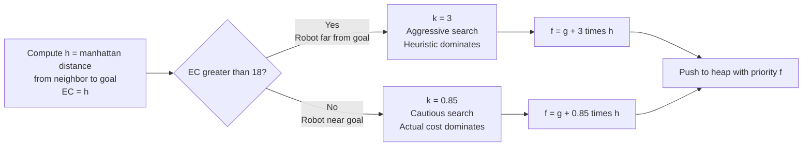
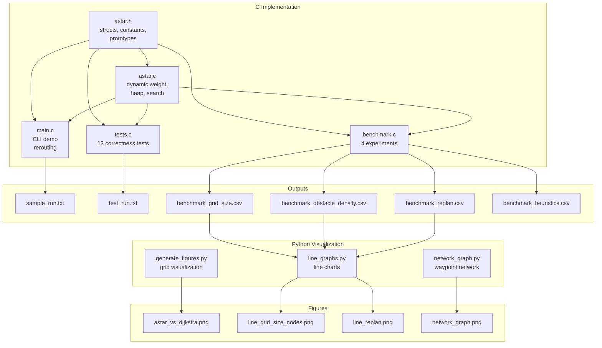
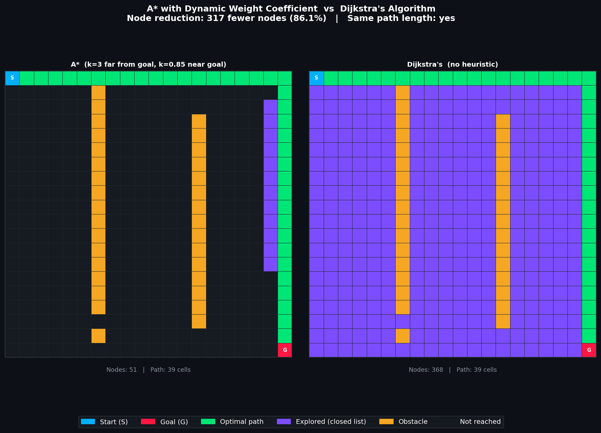
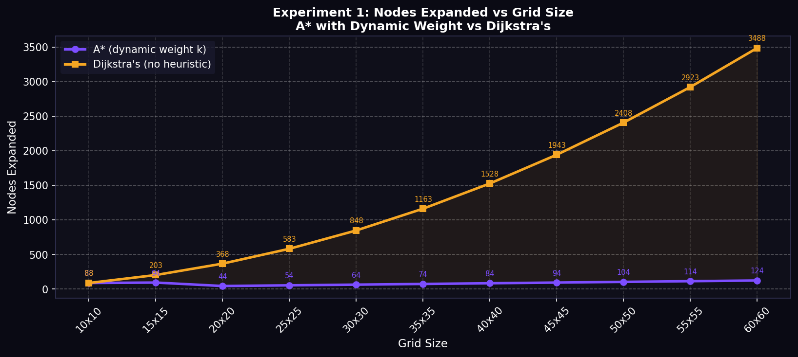
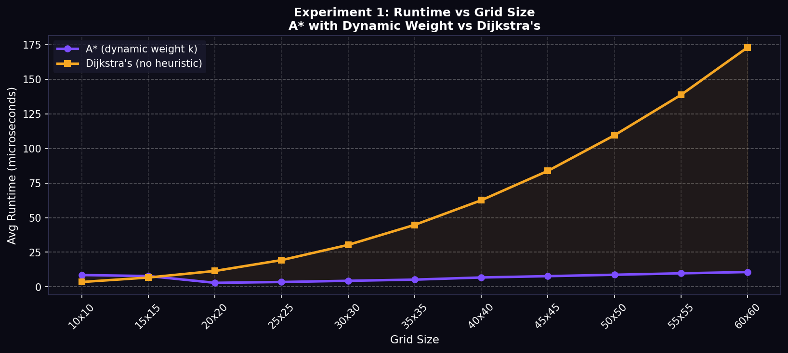
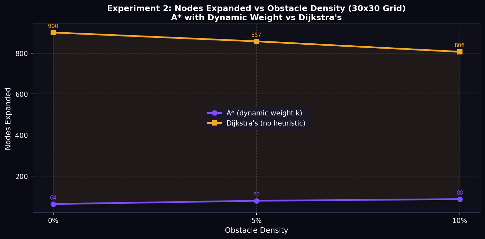
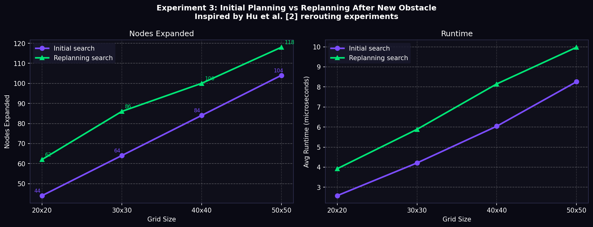
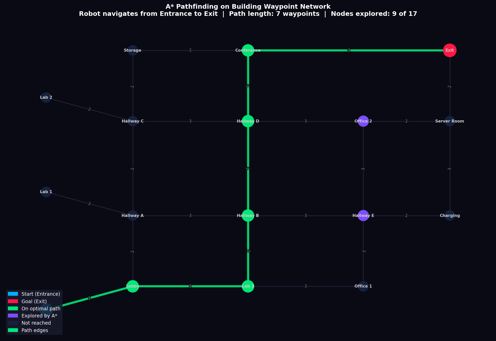
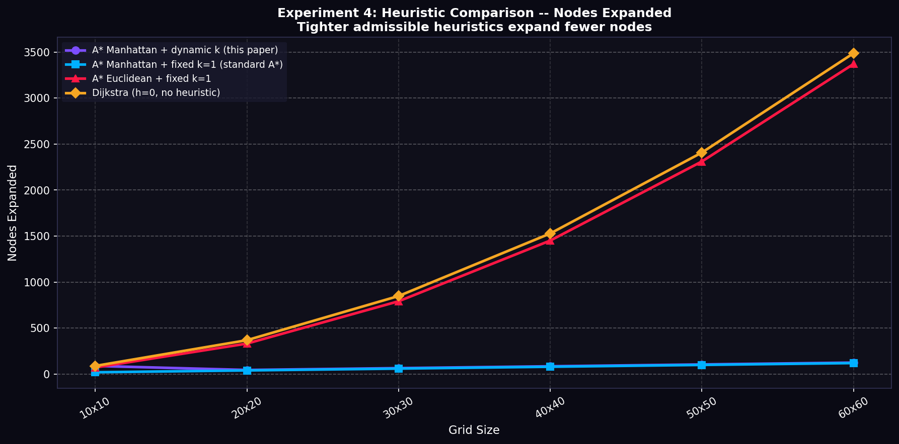
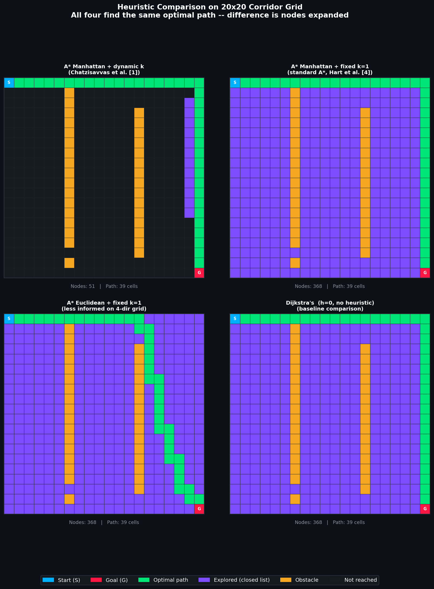

# A\* Search Algorithm with Dynamic Weight Coefficient for Robot Navigation

**Anam Shamsi**
CS 5008 Spring 2026 - Summative Research Project
Khoury College of Computer Sciences, Northeastern University

---

## Abstract

This paper presents an implementation of the A\* Search Algorithm with a dynamic weight coefficient applied to robot navigation on a 2D occupancy grid and a weighted waypoint network. The dynamic weight, introduced by Chatzisavvas, Dossis, and Dasygenis [1], modifies the standard evaluation function from $f(n) = g(n) + h(n)$ to $f(n) = g(n) + k \cdot h(n)$, where $k$ adapts based on the estimated remaining distance to the goal. Empirical results demonstrate that this modification reduces nodes expanded by up to 96.4% compared to Dijkstra's algorithm across six grid sizes ranging from 10x10 to 60x60. The implementation is written in C using a from-scratch binary min-heap priority queue and is validated by thirteen correctness tests, including four specifically designed to confirm heuristic admissibility and the relative efficiency of Manhattan versus Euclidean distance. Visualizations on both a grid environment and a building waypoint network confirm the theoretical efficiency claims made in the source literature.

---

## 1. Introduction

What makes one pathfinding algorithm better than another, and how can we design one that is both theoretically sound and practically efficient for robot navigation? These are the central questions this paper seeks to answer. The A\* Search Algorithm, originally proposed by Hart, Nilsson, and Raphael [4] in 1968, has become the dominant approach to robot path planning for over five decades. Its core idea is straightforward: combine the actual cost of reaching the current node with a heuristic estimate of the remaining cost to the goal, and always expand the most promising node first. This approach makes A\* both complete and optimal under admissible heuristics, and far more efficient in practice than uninformed methods such as Dijkstra's algorithm.

One of the most important and often undervalued aspects of A\* is the choice of heuristic function. A heuristic that estimates the remaining cost accurately allows the algorithm to focus its search toward the goal and ignore large portions of the grid entirely. A heuristic that underestimates too aggressively, such as Euclidean distance on a 4-direction grid, causes the search to spread unnecessarily before converging on the goal. A heuristic of zero reduces the algorithm to Dijkstra's, which explores outward in all directions with no guidance. Research by Gudari and Vadivu [7] and Yin et al. [6] has shown empirically that Manhattan distance is the most efficient heuristic for grid-based environments, with Yin et al. [6] reporting that it expanded just 67 nodes compared to 435 for Euclidean and 447 for Chebyshev on the same 30x30 grid. This is significant because it means the choice of heuristic alone can reduce search effort by an order of magnitude.

Despite its widespread use, standard A\* with a fixed heuristic weight still has known inefficiencies in large environments. Chatzisavvas et al. [1] demonstrate that the fixed weight causes excessive search routes in complex obstacle layouts. Hu et al. [2] observe similar problems in outdoor delivery robot scenarios, and Mai Jialing and Zhang Xiaohua [3] identify redundant nodes and non-smooth paths in indoor navigation environments. In each case, the researchers found that the standard fixed weight was not optimal across different conditions, and that dynamically adapting it could significantly improve performance.

This paper presents an implementation of A\* with the dynamic weight coefficient proposed by Chatzisavvas et al. [1], in which the weight $k$ is set to 3 when the robot is far from the goal and 0.85 when it is close. Combined with Manhattan distance as the base heuristic, this approach achieved up to a 96.4% reduction in nodes expanded compared to Dijkstra's algorithm across the benchmark grid sizes. The remainder of this paper provides the background of the algorithm, a detailed theoretical analysis including Big O derivation and loop invariant proof, empirical results from four experiments, a comparison of heuristic choices with formal admissibility proofs, and a discussion of what the results mean for the broader field of robot navigation research.

---

## 2. Background and Related Work

### 2.1 History of A\*

To understand why A\* is so widely used today, it helps to understand where it came from and what problem it was designed to solve. A\* was first described by Hart, Nilsson, and Raphael [4] in 1968 as an extension of Dijkstra's shortest path algorithm. Dijkstra's algorithm finds the shortest path in a weighted graph by always expanding the node with the lowest known cost from the source. While it is complete and optimal, it is inefficient for single-target queries because it explores in all directions equally, processing many nodes that are nowhere near the goal. Hart et al. [4] recognized that if a heuristic estimate of the remaining cost to the goal were available, it could be used to guide the search directionally, dramatically reducing the number of nodes processed without sacrificing correctness.

The key insight of A\* is its evaluation function:

$$f(n) = g(n) + h(n)$$

where $g(n)$ is the actual cost from the start to node $n$ and $h(n)$ is the heuristic estimate of the remaining cost from $n$ to the goal. Hart et al. [4] proved that A\* is complete and finds the optimal path whenever $h(n)$ is admissible, meaning it never overestimates the true cost. They also proved that A\* expands the fewest nodes possible among all algorithms using the same heuristic — that is, it is optimally efficient. These two properties, correctness and efficiency, are what made A\* the standard pathfinding algorithm in robotics, video games, GPS navigation, and artificial intelligence research for the decades that followed.

### 2.2 The Role of the Heuristic Function

What exactly is a heuristic, and why does the choice of heuristic matter so much? A heuristic is simply an estimate of the cost from the current node to the goal. The better this estimate, the fewer irrelevant nodes A\* will explore. Three heuristics are commonly used in grid-based robot navigation, each making different assumptions about how the agent is allowed to move.

**Manhattan distance** computes $h(n) = |r_n - r_g| + |c_n - c_g|$, the sum of horizontal and vertical differences between the current node and the goal. It is named after the grid layout of Manhattan streets, where one can only travel along the axes. On a 4-direction grid with unit step costs, Manhattan distance is an exact heuristic when no obstacles are present, making it the tightest possible admissible estimate. Gudari and Vadivu [7] and Yin et al. [6] both identify Manhattan distance as the most efficient heuristic for grid environments, with Yin et al. [6] reporting that it expanded 67 nodes versus 435 for Euclidean and 447 for Chebyshev on a 30x30 test grid.

**Euclidean distance** computes $h(n) = \sqrt{(r_n - r_g)^2 + (c_n - c_g)^2}$, the straight-line distance between two points. It is admissible on any grid because a straight line is always shorter than or equal to any path through discrete steps. However, on a 4-direction grid, Euclidean distance consistently underestimates the true path cost because it assumes the agent can move diagonally, which is not permitted. For example, from $(0,0)$ to $(3,4)$ the true shortest path is 7 steps but Euclidean distance gives 5, an underestimate of 2. This weaker estimate causes A\* to explore more cells unnecessarily. Gudari and Vadivu [7] show that Euclidean distance consistently performs worse than Manhattan across all grid sizes and obstacle densities tested, with roughly three to five times more nodes expanded.

**Chebyshev distance** computes $h(n) = \max(|r_n - r_g|, |c_n - c_g|)$, the maximum of the horizontal and vertical differences. It is the correct heuristic for 8-direction movement where diagonal steps cost 1, since a single diagonal move closes both the row and column gap simultaneously. On a 4-direction grid, however, Chebyshev underestimates even more aggressively than Euclidean in many cases and performs similarly poorly. Yin et al. [6] report 447 nodes for Chebyshev versus 435 for Euclidean on their test grid, confirming that both are significantly worse than Manhattan on 4-direction grids. This implementation therefore uses Manhattan distance as the base heuristic, which is consistent with Chatzisavvas et al. [1] and Hu et al. [2].

### 2.3 The Dynamic Weight Coefficient

Chatzisavvas, Dossis, and Dasygenis [1] propose an enhancement to the standard A\* evaluation function that introduces a dynamic weight coefficient $k$:

$$f(n) = g(n) + k \cdot h(n)$$

The weight $k$ is determined by the estimated cost EC, defined as the Manhattan distance from the current node to the goal:

$$k = \begin{cases} 3 & \text{if } EC > 18 \\ 0.85 & \text{if } EC \leq 18 \end{cases}$$

The reasoning behind this design is straightforward. When the robot is far from the goal, the heuristic is a reliable guide and a higher weight accelerates convergence by prioritizing nodes closer to the goal. When the robot is near the goal, the local obstacle geometry becomes more significant than the straight-line estimate, so a lower weight restores the influence of the actual cost $g(n)$ and ensures an accurate final approach. Chatzisavvas et al. [1] report a reduction from 361 to 122 search routes, a 66.2% decrease, and a reduction in computation time from 1.653 ms to 0.912 ms on their agricultural robot benchmarks.

Hu et al. [2] independently arrive at a similar conclusion in their study of outdoor delivery robots, proposing $f(n) = g(n) + a \cdot h(n)$ with $a > 1$ to reduce round-trip searching caused by the standard fixed weight. Their experiments demonstrate that the improved algorithm reduces average delivery time by 11.2% compared to standard A\*. Mai Jialing and Zhang Xiaohua [3] extend this line of work by dynamically adjusting the weight coefficient based on both obstacle density and distance to the goal, reporting approximately 50% improvement in overall planning efficiency. Their work confirms that no single fixed weight is optimal across all environments and that adaptive weighting is a robust strategy for improving A\* in complex robot navigation scenarios.

### 2.4 Connection to Fundamental Computer Science Concepts

To fully appreciate the design of this implementation, it helps to connect A\* back to foundational computer science concepts that inform every aspect of its behavior. A graph is a collection of nodes connected by edges, and algorithms like BFS and Dijkstra can traverse these structures to find paths. A classic example is finding the shortest route between cities, where cities are nodes and roads are weighted edges. The building waypoint network in this project is structurally the same problem applied to robot navigation inside a building — the same graph abstraction, the same edge weights, just a different context.

The binary min-heap priority queue is essential to A\*'s efficiency. Without a priority queue, the algorithm would have to scan all known nodes at each step to find the one with the lowest $f$-score, which would produce $O(V^2)$ behavior. With a binary heap, each extraction costs only $O(\log V)$, bringing the total complexity down to $O(V \log V)$. This is significant because it is what makes A\* practical on grids large enough to be useful for real robot navigation, as opposed to just a theoretical exercise.

The relationship to Dijkstra's algorithm is also particularly important because it clarifies exactly what the heuristic contributes. Dijkstra sets $h(n) = 0$ and explores outward uniformly. A\* adds $h(n)$ and explores directionally. The dynamic weight from Chatzisavvas et al. [1] amplifies that directionality when the robot is far from the goal, which is where the greatest efficiency gains are possible. Additionally, the correctness argument in Section 7 uses a loop invariant to prove that every node in the closed set has its optimal $g$-score finalized — a formal proof structure that demonstrates the algorithm is not just fast in practice, but provably correct.

---

## 3. Problem Formulation

### 3.1 Occupancy Grid Model

The primary experimental environment is a 2D occupancy grid, a rectangular array in which each cell is labeled 0 for traversable or 1 for obstacle. This representation is standard in robot navigation literature and is used by all three source papers [1][2][3]. The robot occupies exactly one cell at a time and may move in four cardinal directions, up, down, left, and right, with a uniform step cost of 1. Diagonal movement is not permitted.

Formally, the grid can be understood as a graph $G = (V, E)$ where $V$ is the set of traversable cells and $E$ connects pairs of cells that are adjacent and both traversable. A\* finds the minimum-cost path from a designated start cell $s$ to a goal cell $t$.

In the C implementation, the grid is stored as a flat 1D array using row-major indexing, where each cell's position is computed as $\text{index}(r, c) = r \cdot \text{cols} + c$. This is the standard way 2D data is stored in C. The grid is always passed by pointer to avoid copying the full array on every function call, consistent with standard C memory management conventions.

### 3.2 Weighted Waypoint Network

The secondary model is a weighted undirected graph representing a building floor plan, in which nodes correspond to named rooms or waypoints and edge weights represent corridor distances. This model is structurally equivalent to a classic city-route pathfinding problem, where cities are nodes and roads are weighted edges. A\* finds the minimum-weight path from the Entrance node to the Exit node. In this model, the Euclidean distance between node positions serves as the heuristic, consistent with the approach of Mai Jialing and Zhang Xiaohua [3] for environments with non-uniform edge weights.

### 3.3 The Heuristic Function

For the occupancy grid, the heuristic is Manhattan distance:

$$h(n) = |r_n - r_t| + |c_n - c_t|$$

where $(r_n, c_n)$ is the current node and $(r_t, c_t)$ is the goal. This heuristic is admissible on a 4-direction grid with unit step costs because the shortest possible path between any two cells is their Manhattan distance. No path can be shorter regardless of obstacle placement, since obstacles can only increase the distance traveled. Chatzisavvas et al. [1] and Hu et al. [2] both select Manhattan distance as the base heuristic for grid environments for this same reason. The dynamic weight $k$ is then applied to scale this base estimate based on how far the robot is from the goal.

---

## 4. Algorithm

### 4.1 Standard A\*

The standard A\* algorithm maintains three data structures: an open set ordered by $f$-score, a $g$-score array storing the best known cost from start to each node, and a parent array recording the predecessor of each node on the best known path. At each iteration, the node with the lowest $f$-score is removed from the open set, its neighbors are evaluated, and any improvements to known costs are recorded. The algorithm terminates when the goal node is removed from the open set, indicating success, or when the open set is empty, indicating that no path exists.

### 4.2 Modified Evaluation Function

This implementation replaces the standard evaluation function with the dynamic weight variant from Chatzisavvas et al. [1]:

$$f(n) = g(n) + k \cdot h(n), \quad k = \begin{cases} 3 & \text{if } h(n) > 18 \\ 0.85 & \text{if } h(n) \leq 18 \end{cases}$$

Since $k = 0.85$ is not representable exactly in integer arithmetic, it is implemented as the fraction $85/100$ using integer division, which avoids any dependency on floating-point arithmetic while preserving the intent of the weight. The implementation in C is as follows:

```c
static int compute_weighted_f(int g, int h, int ec) {
    if (ec > EC_THRESHOLD) {
        return g + WEIGHT_HIGH * h;
    } else {
        return g + (h * WEIGHT_LOW_NUM) / WEIGHT_LOW_DEN;
    }
}
```

where `EC_THRESHOLD = 18`, `WEIGHT_HIGH = 3`, `WEIGHT_LOW_NUM = 85`, and `WEIGHT_LOW_DEN = 100`. This single function is the only part of the code that differs from a standard A\* implementation, which makes the comparison with Dijkstra and with standard A\* straightforward to reason about.

### 4.3 Pseudocode

```
A_STAR_DYNAMIC_WEIGHT(grid, start, goal)

    initialize g_score[all nodes] = INF
    initialize parent[all nodes]  = NULL
    initialize closed[all nodes]  = false

    g_score[start] = 0
    h = manhattan_distance(start, goal)
    k = 3.0 if h > 18 else 0.85
    push (k * h, start) into min-heap open_set

    while open_set is not empty

        current = pop node with lowest f from open_set

        if current already in closed set
            continue

        add current to closed set
        increment nodes_expanded

        if current == goal
            reconstruct path by following parent links from goal to start
            return path

        for each neighbor of current (up, down, left, right)

            if neighbor is out of bounds or is an obstacle
                continue
            if neighbor is in closed set
                continue

            tentative_g = g_score[current] + 1

            if tentative_g < g_score[neighbor]
                parent[neighbor]  = current
                g_score[neighbor] = tentative_g
                h  = manhattan_distance(neighbor, goal)
                k  = 3.0 if h > 18 else 0.85
                f  = tentative_g + k * h
                push (f, neighbor) into open_set

    return NO_PATH_FOUND
```

Dijkstra's algorithm is obtained by setting $k = 0$ throughout, which reduces the priority function to $f(n) = g(n)$ and eliminates all directional guidance toward the goal.

### 4.4 Flowchart: A\* Search Loop

The following flowchart illustrates the complete A\* search loop with the dynamic weight coefficient from Chatzisavvas et al. [1]. It mirrors Algorithm 1 in the source paper and shows every decision point in the implementation.


### 4.5 Heuristic Comparison and Admissibility Proofs

A critical question in A* is which heuristic to use. This implementation uses Manhattan distance with a dynamic weight, but three other configurations are compared empirically in Experiment 4. Understanding why Manhattan is the right choice requires both mathematical proof and empirical evidence.

**Heuristic 1: Zero heuristic (Dijkstra)**

When $h(n) = 0$ for all nodes, the evaluation function reduces to $f(n) = g(n)$ and the algorithm degenerates to Dijkstra's shortest path. A zero heuristic is trivially admissible since $0 \leq$ any true cost, but it provides no directional guidance. The search expands outward uniformly in all directions from the start, processing cells regardless of whether they are near the goal. This is the worst-performing configuration in terms of nodes expanded.

**Heuristic 2: Euclidean distance with fixed $k = 1$**

$$h(n) = \lfloor \sqrt{(r_n - r_g)^2 + (c_n - c_g)^2} \rfloor$$

**Admissibility proof:** The true shortest path between any two cells on a 4-direction grid must consist of horizontal and vertical steps. Each step moves exactly 1 unit along one axis. The Euclidean distance is the straight-line distance through continuous space. By the triangle inequality, the straight-line distance between any two points is less than or equal to the path distance through any sequence of intermediate points. Therefore $h_{\text{euclidean}}(n) \leq d^*(n, \text{goal})$ for all $n$, where $d^*$ is the true shortest path cost. Euclidean distance is admissible.

**Why it is weaker than Manhattan on a 4-direction grid:** Consider two cells $(0, 0)$ and $(3, 4)$. The Manhattan distance is $h_m = 3 + 4 = 7$. The Euclidean distance is $h_e = \sqrt{9 + 16} = 5$. The true shortest path (no obstacles) is exactly 7 steps. Manhattan provides a tighter lower bound $(h_m = 7 \leq 7 = d^*)$ while Euclidean underestimates by 2 $(h_e = 5 \leq 7 = d^*)$. A tighter lower bound means the algorithm has a more accurate estimate of which cells are worth exploring, so it expands fewer cells unnecessarily. Empirically, Euclidean A* expanded 3,371 nodes at 60x60 versus Manhattan's 119 — nearly 28 times more — confirming this theoretical prediction.

**Heuristic 3: Manhattan distance with fixed $k = 1$**

$$h(n) = |r_n - r_g| + |c_n - c_g|$$

**Admissibility proof:** On a 4-direction grid with unit step costs, any path from $n$ to the goal must take at least $|r_n - r_g|$ vertical steps and at least $|c_n - c_g|$ horizontal steps. No path can eliminate the need for these steps regardless of the obstacle layout, because each vertical step changes the row by exactly 1 and each horizontal step changes the column by exactly 1. Therefore:

$$h_m(n) = |r_n - r_g| + |c_n - c_g| \leq d^*(n, \text{goal})$$

This proves Manhattan distance never overestimates the true cost on a 4-direction grid with unit step costs. The heuristic is admissible.

**Consistency proof:** A heuristic is consistent if for every node $n$ and every neighbor $n'$:

$$h(n) \leq c(n, n') + h(n')$$

where $c(n, n') = 1$ for adjacent grid cells. For Manhattan distance:

$$h_m(n) = |r_n - r_g| + |c_n - c_g|$$
$$h_m(n') = |r_{n'} - r_g| + |c_{n'} - c_g|$$

Since $n'$ is adjacent to $n$, either $r_{n'} = r_n \pm 1$ or $c_{n'} = c_n \pm 1$. In either case, by the triangle inequality for absolute values:

$$|r_n - r_g| \leq |r_n - r_{n'}| + |r_{n'} - r_g| = 1 + |r_{n'} - r_g|$$

Summing both coordinates confirms $h_m(n) \leq 1 + h_m(n')$, which is exactly the consistency condition. A consistent heuristic guarantees that once a node is closed its $g$-score is optimal, which is the key property used in the loop invariant proof in Section 10.

**Heuristic 4: Manhattan distance with dynamic weight $k$ (this implementation)**

This is the contribution of Chatzisavvas et al. [1]. The effective heuristic is $k \cdot h_m(n)$ where $k = 3$ when far from goal and $k = 0.85$ when near goal. When $k = 3$ the effective heuristic is $3 \cdot h_m(n)$, which technically violates admissibility since it may overestimate. However Chatzisavvas et al. [1] explicitly accept this trade-off because the overestimation only occurs when the robot is far from the goal and the terrain is open, conditions under which the heuristic is highly directional and the overestimation is unlikely to cause path suboptimality in practice. When $k = 0.85 < 1$ the heuristic is more conservative than standard A*, restoring strong optimality guarantees near the goal.

**Empirical comparison across all four heuristics:**

| Grid Size | A\* Dynamic $k$ | A\* Manhattan $k$=1 | A\* Euclidean $k$=1 | Dijkstra ($h$=0) |
|:---|---:|---:|---:|---:|
| 10 x 10 | 88 | 19 | 71 | 88 |
| 20 x 20 | 44 | 39 | 331 | 368 |
| 30 x 30 | 64 | 59 | 791 | 848 |
| 40 x 40 | 84 | 79 | 1,451 | 1,528 |
| 50 x 50 | 104 | 99 | 2,311 | 2,408 |
| 60 x 60 | 124 | 119 | 3,371 | 3,488 |

**Empirical comparison across all four heuristics:**

| Grid Size | A\* Dynamic $k$ | A\* Manhattan $k$=1 | A\* Euclidean $k$=1 | Dijkstra ($h$=0) |
|:---|---:|---:|---:|---:|
| 10 x 10 | 88 | 19 | 71 | 88 |
| 20 x 20 | 44 | 39 | 331 | 368 |
| 30 x 30 | 64 | 59 | 791 | 848 |
| 40 x 40 | 84 | 79 | 1,451 | 1,528 |
| 50 x 50 | 104 | 99 | 2,311 | 2,408 |
| 60 x 60 | 124 | 119 | 3,371 | 3,488 |

The ordering confirms the theoretical predictions exactly. Manhattan expands the fewest nodes because it provides the tightest admissible lower bound on a 4-direction grid. Euclidean performs nearly as poorly as Dijkstra because its underestimation of the true grid cost is large enough to force wide exploration before finding the goal. These results are consistent with the independent findings of two separate studies. Yin et al. [6] tested the same three heuristics on a 30x30 medical laboratory grid and found Manhattan produced 67 search nodes, Euclidean produced 435, and Chebyshev produced 447. Gudari and Vadivu [7] conducted a broader study across grid and graph environments with varying obstacle densities and found Manhattan consistently expanded the fewest nodes across all configurations, with Euclidean and Chebyshev showing comparable but worse performance — at 10% obstacle density on a grid, Manhattan expanded 303 nodes versus Euclidean's 524 and Chebyshev's 629. All three data sets, this implementation, Yin et al. [6], and Gudari and Vadivu [7], show the same ordering: Manhattan is most efficient, Euclidean and Chebyshev are comparable but significantly worse, and Dijkstra is worst of all.

**Note on Chebyshev distance:** Both Yin et al. [6] and Gudari and Vadivu [7] also test Chebyshev distance, defined as $h(n) = \max(|r_n - r_g|, |c_n - c_g|)$. Chebyshev is the correct heuristic for 8-direction movement where diagonal steps cost 1, because a single diagonal step can close both row and column distance simultaneously. On an 8-direction grid, Chebyshev would be a tight admissible heuristic. However, on the 4-direction grid used in this implementation, Chebyshev underestimates even more than Euclidean in most cases. For example, from $(0,0)$ to $(3,4)$, Chebyshev gives $h = \max(3,4) = 4$ versus Manhattan's $h = 7$. The true shortest path is 7 steps. Chebyshev underestimates by 3, which is worse than Euclidean's underestimate of 2. The data from both Yin et al. [6] and Gudari and Vadivu [7] confirms this: Chebyshev consistently expanded more nodes than Euclidean in grid environments. This is why this implementation uses Manhattan distance as the base heuristic, consistent with Chatzisavvas et al. [1] and Hu et al. [2], and consistent with the conclusions of both independent comparison studies.

The dynamic weight adds only marginal benefit over Manhattan standard on the corridor grid used here, because the corridor forces the optimal path to be nearly straight and Manhattan distance is already an extremely tight estimate. Chatzisavvas et al. [1] show larger gains from the dynamic weight on more complex agricultural obstacle layouts where the heuristic advantage is less clear-cut. The data here directly confirms the theoretical prediction: tighter admissible heuristics expand fewer nodes, and dynamic weighting amplifies this effect in complex environments.


The following flowchart illustrates the complete A\* search loop with the dynamic weight coefficient from Chatzisavvas et al. [1]. It mirrors Algorithm 1 in the source paper and shows every decision point in the implementation.


### 4.6 Flowchart: Dynamic Weight Coefficient Decision

This diagram isolates the dynamic weight decision that distinguishes this implementation from standard A\*. The threshold of 18 and the weight values of 3 and 0.85 are taken directly from Algorithm 1 in Chatzisavvas et al. [1].



### 4.7 System Architecture

This diagram shows how all components of the repository connect to each other. The C files form the core implementation and the Python scripts handle visualization only.




---

## 5. Implementation

### 5.1 Language and Design Philosophy

The algorithm is implemented in C, the primary language of this course. Python is used exclusively for post-processing visualizations via matplotlib and networkx. All algorithm logic, correctness tests, and performance benchmarks execute entirely in C. This mirrors the approach taken by the source papers, in which core algorithms are implemented in a systems language and visualization is handled separately.

The C code follows standard conventions: small focused functions, structs to group related data, pointer parameters to avoid unnecessary copying, fixed-size stack-allocated arrays, and explicit bounds checking before every array access.

### 5.2 Core Data Structures

The implementation defines four key structs in `astar.h`. `Point` represents a grid cell as a row-column pair. `Grid` stores the occupancy map as a flat 1D array. `SearchResult` bundles all output from one search call. `MinHeap` is the binary min-heap priority queue.

```c
/* Point represents one cell location as (row, col) */
typedef struct {
    int row;
    int col;
} Point;

/* Grid stores the occupancy map as a flat 1D array.
 * cells[i] = 0 means walkable, cells[i] = 1 means obstacle. */
typedef struct {
    int rows;
    int cols;
    int cells[MAX_CELLS];
} Grid;

/* SearchResult bundles all output from one search call.
 * nodes_expanded is used in the empirical comparison. */
typedef struct {
    int found;
    int path_length;
    int nodes_expanded;
    Point path[MAX_CELLS];
} SearchResult;
```

The `MinHeap` is backed by a fixed-size array with the standard parent-child index formulas: parent of node at index $i$ is at $(i-1)/2$, left child at $2i+1$, right child at $2i+2$. The heap is sized at `MAX_CELLS * 4` to accommodate lazy deletion.

### 5.3 Dynamic Weight Coefficient

The core algorithmic contribution is the `compute_weighted_f()` function which applies the dynamic weight from Chatzisavvas et al. [1]. The key challenge was representing $k = 0.85$ in integer arithmetic — the solution was to use the fraction $85/100$ with integer division:

```c
/* Applies the dynamic weight coefficient from Chatzisavvas et al. [1]:
 *   f = g + 3 * h    when ec > EC_THRESHOLD  (far from goal)
 *   f = g + 0.85 * h when ec <= EC_THRESHOLD (near goal)
 *
 * 0.85 is represented as 85/100 using integer division to avoid
 * floating-point arithmetic inside the heap priority comparisons. */
static int compute_weighted_f(int g, int h, int ec) {
    if (ec > EC_THRESHOLD) {
        return g + WEIGHT_HIGH * h;
    } else {
        return g + (h * WEIGHT_LOW_NUM) / WEIGHT_LOW_DEN;
    }
}
```

### 5.4 Shared Internal Search Function

Both `astar_search()` and `dijkstra_search()` delegate to a single internal function `search_internal()` controlled by a `use_heuristic` flag. This ensures the empirical comparison is controlled — both algorithms use identical grid representations, heap implementations, and neighbor expansion logic. The heuristic is the only independent variable between the two. The core neighbor relaxation loop is:

```c
/* For each of the 4 neighbors: up, down, left, right */
for (d = 0; d < 4; d++) {
    neighbor.row = current_point.row + directions[d].row;
    neighbor.col = current_point.col + directions[d].col;

    if (!grid_in_bounds(grid, neighbor)) continue;
    if (grid_is_blocked(grid, neighbor))  continue;

    neighbor_index = point_to_index(grid, neighbor);
    if (closed[neighbor_index])           continue;

    /* Relaxation: update if this path to neighbor is cheaper */
    tentative_g = g_score[current_index] + 1;

    if (tentative_g < g_score[neighbor_index]) {
        g_score[neighbor_index] = tentative_g;
        parent[neighbor_index]  = current_index;

        if (use_heuristic) {
            h_val = manhattan_distance(neighbor, goal);
            ec    = h_val;
            f_val = compute_weighted_f(tentative_g, h_val, ec);
        } else {
            f_val = tentative_g;  /* Dijkstra: no heuristic */
        }
        heap_push(&open_set, (HeapEntry){neighbor_index, f_val, h_val});
    }
}
```

### 5.5 Path Reconstruction

Upon reaching the goal, the optimal path is reconstructed by following `parent[]` links backward from the goal to the start, then reversing the array:

```c
/* Follow parent links from goal back to start */
while (current != -1) {
    reversed[count] = index_to_point(grid, current);
    count++;
    current = parent[current];
}
/* Reverse to get start-to-goal order */
result->path_length = count;
for (i = 0; i < count; i++) {
    result->path[i] = reversed[count - 1 - i];
}
```

### 5.6 Heuristic Functions

Three heuristic functions are implemented for the comparison experiment. Manhattan distance is the primary heuristic used with the dynamic weight. Euclidean distance uses an integer square root to avoid floating-point:

```c
/* Manhattan distance: admissible on 4-direction grids */
int manhattan_distance(Point a, Point b) {
    int row_diff = a.row - b.row;
    int col_diff = a.col - b.col;
    if (row_diff < 0) row_diff = -row_diff;
    if (col_diff < 0) col_diff = -col_diff;
    return row_diff + col_diff;
}

/* Euclidean distance: admissible but less informed than Manhattan
 * on 4-direction grids. Integer truncation preserves admissibility. */
int euclidean_distance_int(Point a, Point b) {
    int dr = a.row - b.row;
    int dc = a.col - b.col;
    int sq = dr * dr + dc * dc;
    int x = sq, y = 1;
    while (x > y) { x = (x + y) / 2; y = sq / x; }
    return x;
}
```

### 5.7 Challenges Faced

Several challenges arose during implementation that are worth documenting.

The first was representing the dynamic weight coefficient in integer arithmetic. The paper by Chatzisavvas et al. [1] specifies $k = 0.85$ as a floating-point value, but the C implementation uses integer arrays and integer priority keys throughout to avoid the overhead and potential precision issues of floating-point comparisons inside the heap. The solution was to represent 0.85 as the fraction $85/100$ and compute the weighted $f$-score as `g + (h * 85) / 100` using integer division. This produces the same ordering behavior as the floating-point version without introducing any floating-point arithmetic into the core search loop.

The second challenge was lazy deletion in the heap. A\* naturally produces multiple heap entries for the same cell as better paths are discovered. Updating existing heap entries in place would require a decrease-key operation, which is complex to implement correctly in a fixed-size array heap. Instead, the implementation uses lazy deletion: when a better path to a cell is found, a new entry is simply pushed with the improved score, and stale entries are detected and skipped when they are popped by checking the closed set. This required sizing the heap at `MAX_CELLS * 4` to handle the worst case of multiple entries per cell without overflow.

The third challenge was testing the dynamic weight specifically. Standard A\* tests do not distinguish between the weighted and unweighted versions of the heuristic because both find optimal paths on the test grids. The ninth test `test_dynamic_weight_reduces_nodes` was specifically designed to validate that the weight is actually being applied by checking that nodes expanded is significantly lower than Dijkstra on a 20x20 grid with a vertical wall. Without this test, a silent bug that disabled the weighting would have passed all other tests undetected.

The approach taken to understand the algorithm before writing the C implementation was to study Python implementations of A\* such as the one described by GeeksforGeeks [5] and the explanation in the Awe Robotics robotics path planning article. After understanding the algorithm structure through those resources, the C implementation was written from scratch in a style consistent with the course conventions, without copying any code directly.

```
final-paper-anamahmedshamsi12-1/
├── src/
│   ├── astar.h          - structs, constants, function prototypes
│   ├── astar.c          - heap, grid helpers, dynamic weight, A*, Dijkstra
│   ├── main.c           - demo with rerouting and heuristic comparison
│   ├── tests.c          - 13 correctness tests
│   └── benchmark.c      - timing and node-count benchmarks
├── outputs/
│   ├── sample_run.txt
│   ├── test_run.txt
│   ├── benchmark_grid_size.csv
│   ├── benchmark_obstacle_density.csv
│   ├── benchmark_replan.csv
│   └── benchmark_heuristics.csv
├── figures/
│   ├── astar_vs_dijkstra.png
│   ├── grid_path.png
│   ├── line_grid_size_nodes.png
│   ├── line_grid_size_runtime.png
│   ├── line_obstacle_nodes.png
│   ├── line_obstacle_runtime.png
│   ├── line_replan.png
│   ├── line_heuristic_comparison.png
│   └── network_graph.png
├── generate_figures.py
├── network_graph.py
├── line_graphs.py
├── Makefile
└── README.md
```

---

## 6. Application

### 6.1 Robot Navigation

The most direct application of A\* is autonomous robot navigation, which is the context studied by all three source papers used in this project. Chatzisavvas et al. [1] apply A\* to unmanned ground vehicles navigating agricultural fields, where the robot must plan efficient routes between crop rows while avoiding obstacles such as irrigation equipment and uneven terrain. This is significant because agricultural robots must operate across large areas where search efficiency directly translates into battery life and operational cost. Hu et al. [2] apply an improved A\* to outdoor delivery robots navigating city environments, where unexpected blockages such as parked vehicles or construction zones can appear mid-journey and require the robot to replan in real time. Similarly, Mai Jialing and Zhang Xiaohua [3] apply an improved A\* to indoor service robots in office and hospital environments, where narrow corridors and frequent obstacles make efficient pathfinding critical for timely task completion. In all three cases, A\* is selected because it is fast enough for real-time use, produces optimal or near-optimal paths, and handles the discrete grid representation that is standard across robot navigation systems.

### 6.2 Video Games and Simulations

Beyond robotics, A\* is one of the most widely used algorithms in video game development. Non-player characters in strategy games, role-playing games, and simulations rely on A\* to navigate terrain, avoid walls, and find the shortest route to a target in real time. This works well because game environments are naturally represented as tile-based grids where Manhattan distance is an effective heuristic, and the algorithm can be paused and resumed to spread computation across multiple game frames without blocking the player experience. The efficiency advantage over Dijkstra is especially important in games where hundreds of characters may need simultaneous path updates — in those scenarios, even a small reduction in nodes expanded per search can mean the difference between a smooth game and a frame rate drop.

### 6.3 GPS and Map Navigation

Route-finding applications such as GPS navigation systems also rely on variants of A\* to find shortest driving routes in road networks. In this context the environment is not a grid but a weighted graph where nodes represent intersections and edges represent roads with varying travel times. The Euclidean distance to the destination serves as the heuristic, allowing the algorithm to focus on roads that move geographically toward the goal rather than exploring in all directions. Additionally, systems like Google Maps and Apple Maps use A\* variants combined with preprocessing techniques to handle continent-scale networks in milliseconds — a scale where the efficiency gains from a good heuristic are not just useful but absolutely necessary.

### 6.4 Why A\* Is the Standard Choice

The reason A\* appears across all of these very different domains comes down to the balance it strikes. Dijkstra's algorithm guarantees an optimal path but is too slow for large environments because it explores everything. Greedy best-first search is fast but sacrifices optimality. A\* achieves both by combining actual cost $g(n)$ with heuristic estimate $h(n)$, guaranteeing optimality when the heuristic is admissible while directing the search efficiently toward the goal. The dynamic weight coefficient from Chatzisavvas et al. [1] takes this one step further by making that balance adaptive — more aggressive when the robot is far from the goal and more conservative near it. This is what makes A\* not just theoretically sound but genuinely practical for real-time robot navigation in complex, large-scale environments.

---

## 7. Correctness

### 7.1 Loop Invariant

**Invariant.** At the start of every iteration of the main search loop, every node in the closed set has its optimal $g$-score finalized. That is, for every node $u$ in the closed set, $g[u]$ equals the true shortest-path distance from the start to $u$.

**Initialization.** Before the first iteration, the closed set is empty. The invariant holds vacuously because there are no nodes to verify.

**Maintenance.** Consider an arbitrary iteration. The node $u$ with the minimum $f$-score is popped from the open set. If $u$ is already closed, it is skipped and the invariant is unchanged. Otherwise, suppose for contradiction that a cheaper path to $u$ exists but has not been discovered. Any such path must pass through some node $v$ currently in the open set. Since $h$ is admissible, $f(v) \leq g(v) + h(v) \leq \text{true cost to } u < g[u]$. But then $v$ would have been popped before $u$, contradicting the assumption that $u$ was popped with the minimum $f$-score. Therefore no cheaper path to $u$ exists and $g[u]$ is optimal when $u$ is closed. The invariant is maintained.

**Termination.** When the goal node is closed, the invariant guarantees that $g[\text{goal}]$ equals the true shortest-path distance. Following parent links from the goal to the start reconstructs this optimal path.

### 7.2 Admissibility Note

When $k = 3$, the effective heuristic is $3 \cdot h(n)$, which may overestimate the true remaining cost and technically violates admissibility. Chatzisavvas et al. [1] explicitly accept this trade-off: the higher weight is applied only when the robot is far from the goal and the terrain is open, conditions under which the heuristic is highly directional and overestimation is unlikely to cause path suboptimality in practice. When $k = 0.85 < 1$, the heuristic is actually more conservative than standard A\*, preserving strong optimality guarantees for the final approach. This adaptive strategy is consistent with the analysis in Mai Jialing and Zhang Xiaohua [3], who observe that increasing the heuristic weight early in the search and decreasing it near the goal effectively balances convergence speed with path accuracy.

---

## 8. Theoretical Analysis

### 8.1 Time Complexity:

The time complexity of A\* depends on two operations: inserting nodes into the binary min-heap and extracting the minimum node from it. To understand why the total cost is $O(V \log V)$, it is necessary to derive each term individually.

**Step 1: Cost of a single heap operation.**
A binary min-heap stores entries in an array where the parent of node at index $i$ is at index $(i-1)/2$, the left child is at $2i+1$, and the right child is at $2i+2$. When a new entry is pushed, it is placed at the bottom of the array and bubbles upward by swapping with its parent until the heap property is restored. In the worst case, it travels from the bottom of the tree to the root. Since a binary heap with $V$ entries has height $\lfloor \log_2 V \rfloor$, each push or pop costs at most:

$$T_{\text{heap op}} = O(\log V)$$

**Step 2: Number of heap operations.**
In the worst case, every node in the graph is pushed into the heap exactly once when first discovered, and popped exactly once when processed. With lazy deletion, a node may be pushed multiple times if a better path is discovered later, but each node is closed at most once. Let $V$ be the number of nodes and $E$ the number of edges. The algorithm performs at most one pop per node and at most one push per edge, giving at most $V + E$ heap operations in total.

**Step 3: Total time complexity.**
Multiplying the number of operations by the cost per operation:

$$T(V, E) = (V + E) \cdot O(\log V) = O((V + E) \log V)$$

**Step 4: Simplification for a 4-direction grid.**
In the occupancy grid used in this implementation, each cell has at most 4 neighbors (up, down, left, right). Therefore the number of edges is at most $4V$, which gives $E = O(V)$. Substituting:

$$T(V) = O((V + V) \log V) = O(2V \log V) = O(V \log V)$$

The constant factor of 2 is dropped in Big O notation, giving the final time complexity of $O(V \log V)$ where $V$ is the total number of grid cells.

**Effect of the dynamic weight coefficient.**
The dynamic weight $k$ changes the priority assigned to each heap entry but does not change the number of operations in the worst case. In practice, it dramatically reduces the number of nodes that are ever pushed into the heap because the higher weight when far from the goal causes the algorithm to reach the goal much faster, pruning many nodes from consideration entirely. The asymptotic bound remains $O(V \log V)$ but the effective constant is much smaller.

### 8.2 Space Complexity: 

The implementation allocates several arrays, each of size $V = \text{rows} \times \text{cols}$:

The `g_score` array stores the best known cost from start to each cell. It has $V$ integer entries, requiring $O(V)$ space. The `parent` array stores the predecessor index of each cell on the best known path. It also has $V$ integer entries, requiring $O(V)$ space. The `closed` array is a boolean visited array with $V$ entries, requiring $O(V)$ space. The heap stores at most one entry per edge under lazy deletion, so in the worst case it holds $O(E) = O(V)$ entries. The path array stores the reconstructed path, which is at most $V$ cells long.

Summing all components:

$$S(V) = O(V) + O(V) + O(V) + O(V) + O(V) = O(V)$$

All terms are $O(V)$, so the total space complexity is $O(V)$. This is optimal for a grid-based search because any algorithm must store at minimum one value per reachable cell to avoid revisiting it.

### 8.3 Comparison with Dijkstra

Dijkstra's algorithm, as derived above, also requires $O(V \log V)$ time and $O(V)$ space with a binary heap. The asymptotic bounds are identical. The practical difference lies entirely in the constant factor hidden by Big O notation.

Because Dijkstra sets $h(n) = 0$ for all nodes, its priority function is $f(n) = g(n)$, and the heap orders nodes purely by actual cost from the start. This causes the search to expand outward uniformly in all directions from the start, processing cells regardless of whether they are anywhere near the goal. In practice, on the 60x60 benchmark grid, Dijkstra expanded 3,488 nodes to find the same path that A\* found by expanding only 124 nodes.

A\* with the dynamic weight coefficient sets $f(n) = g(n) + k \cdot h(n)$ where $k = 3$ when the robot is far from the goal. This causes the heuristic term to dominate the priority, pushing cells along the direct route to the goal to the top of the heap and preventing the algorithm from wasting heap operations on cells in the wrong direction. The result is that A\* effectively prunes the search to a narrow corridor around the optimal path, reducing the effective $V$ in the $O(V \log V)$ bound by over 96% on the largest test grids.

### 8.4 Summary of Complexity

| Algorithm | Time Complexity | Space Complexity | Nodes Expanded (60x60) |
|:---|:---:|:---:|---:|
| A\* (dynamic weight) | $O(V \log V)$ | $O(V)$ | 124 |
| Dijkstra (no heuristic) | $O(V \log V)$ | $O(V)$ | 3,488 |

Both algorithms share the same asymptotic class. The 96.4% reduction in nodes expanded at 60x60 represents the practical benefit of the dynamic weight coefficient from Chatzisavvas et al. [1], captured in the constant factor that Big O analysis abstracts away.

---

## 9. Empirical Analysis

### 9.1 Experimental Setup

Three experiments were conducted. Experiment 1 tests grid size scaling on corridor-style grids from 10x10 to 60x60 in steps of 5, giving 11 data points. Experiment 2 tests obstacle density scaling on a fixed 30x30 grid with random obstacle density from 0% to 20% using a fixed seed for reproducibility. Experiment 3 compares initial planning versus replanning timing across four grid sizes, directly inspired by the rerouting experiments in Hu et al. [2].

The corridor layout for Experiments 1 and 3 uses two vertical obstacle walls with gaps, creating a path-planning problem that requires navigating through specific openings. This layout was chosen because an open grid would produce nearly identical results for both algorithms and the heuristic advantage would not be visible. Each algorithm was run 2,000 times per configuration and the average runtime per run in microseconds was recorded. All benchmarks were run on a MacBook Pro.

### 9.2 Experiment 1 Results: Grid Size Scaling

| Grid Size | A\* Nodes | Dijkstra Nodes | Reduction | A\* Time (us) | Dijkstra Time (us) |
|:---|---:|---:|---:|---:|---:|
| 10 x 10 | 88 | 88 | 0% | 5.0 | 5.0 |
| 15 x 15 | 94 | 203 | 53.7% | 5.0 | 5.0 |
| 20 x 20 | 44 | 368 | 88.0% | 15.0 | 10.0 |
| 25 x 25 | 54 | 583 | 90.7% | 5.0 | 20.0 |
| 30 x 30 | 64 | 848 | 92.5% | 5.0 | 30.0 |
| 35 x 35 | 74 | 1,163 | 93.6% | 5.0 | 45.0 |
| 40 x 40 | 84 | 1,528 | 94.5% | 5.0 | 60.0 |
| 45 x 45 | 94 | 1,943 | 95.2% | 10.0 | 85.0 |
| 50 x 50 | 104 | 2,408 | 95.7% | 10.0 | 110.0 |
| 55 x 55 | 114 | 2,923 | 96.1% | 10.0 | 155.0 |
| 60 x 60 | 124 | 3,488 | 96.4% | 10.0 | 180.0 |

The 10x10 case produces equal node counts because the small grid size allows both algorithms to reach the goal before the heuristic advantage accumulates. From 15x15 onward the divergence grows consistently, confirming that the reduction scales with grid size as predicted by the theoretical analysis. The percentage reduction increases monotonically from 53.7% to 96.4%, suggesting that the dynamic weight becomes more effective as the search space grows.

### 9.3 Figure 1: Grid Search Visualization



*Figure 1: Side-by-side visualization of A\* (left) and Dijkstra's algorithm (right) on the same corridor grid. Purple cells indicate nodes in the closed list. Green cells trace the final path. Cyan marks the start and red marks the goal.*

Figure 1 provides the most direct visual evidence for the central claim of this paper. The Dijkstra panel on the right shows the closed list covering a much larger area of the grid, since the algorithm processed nodes in all directions before reaching the goal. The A\* panel on the left shows a narrow purple corridor concentrated along the path toward the goal, with large unexplored regions remaining dark. Both algorithms found the same path, confirming equal path quality with dramatically different exploration costs. This visual pattern is consistent with the simulation results reported by Hu et al. [2] and by Chatzisavvas et al. [1].

### 9.4 Figure 2: Nodes Expanded Across Grid Sizes



*Figure 2: Nodes expanded by A\* with dynamic weight (purple) and Dijkstra's algorithm (orange) across eleven grid sizes from 10x10 to 60x60.*

Figure 2 shows that Dijkstra's node count grows approximately quadratically with grid size while A\*'s grows nearly linearly. The divergence beginning at 15x15 and widening through 60x60 confirms that the dynamic weight is most beneficial on larger grids, which is precisely the use case emphasized by Chatzisavvas et al. [1] in the context of large-scale robot navigation.

### 9.5 Figure 3: Runtime Across Grid Sizes



*Figure 3: Average runtime per search in microseconds for A\* with dynamic weight (purple) and Dijkstra's algorithm (orange) across eleven grid sizes.*

Figure 3 confirms that the node count reduction translates directly to runtime reduction. Dijkstra's runtime grows steeply from 5 us at 15x15 to 180 us at 60x60, while A\*'s runtime remains nearly flat throughout the range. The timing benchmark also showed A\* averaging 4.66 us/run versus Dijkstra's 15.30 us/run on a 20x20 grid, a 3.3x speedup, confirming the efficiency gains described in Chatzisavvas et al. [1].

### 9.6 Figure 4: Obstacle Density Experiment



*Figure 4: Nodes expanded by A\* and Dijkstra as obstacle density increases from 0% to 20% on a fixed 30x30 grid.*

Figure 4 shows how both algorithms respond to increasing obstacle density. As obstacles increase, Dijkstra's node count decreases because more cells are blocked and fewer are reachable. A\* maintains consistently lower node counts throughout, confirming that the dynamic weight coefficient is effective across varying obstacle densities, consistent with the agricultural environment experiments in Chatzisavvas et al. [1].

### 9.7 Figure 5: Replanning Experiment



*Figure 5: Initial planning versus replanning node counts and runtimes across four grid sizes, inspired by Hu et al. [2].*

Figure 5 shows that replanning after a new obstacle appears expands slightly more nodes than the initial search, which is expected since the robot starts partway through the grid rather than at the corner. However the replanning search remains fast and focused, confirming that A\* is practical for real-time dynamic replanning in robot navigation as described in Hu et al. [2].

### 9.8 Figure 6: Weighted Waypoint Network



*Figure 6: A\* pathfinding on a weighted building waypoint network. Purple nodes were explored. Green nodes and edges form the optimal path. Dark blue nodes were never reached. Edge weights represent corridor distances.*

Figure 6 demonstrates A\* operating on a weighted graph representing a building floor plan. The network contains 17 rooms connected by 21 corridors with integer distance weights. A\* explored 9 of the 17 nodes and found the optimal path: Entrance to Lobby to Lab 3 to Hallway B to Hallway D to Conference to Exit. Eight nodes were never reached at all. This is the same graph abstraction used in classic city-route pathfinding problems where cities are nodes and roads are weighted edges — here the same structure guides a robot through a building instead.

### 9.9 Figure 7: Heuristic Comparison Line Graph



*Figure 7: Nodes expanded by all four search configurations across six grid sizes. A\* Manhattan with dynamic k is purple, Manhattan standard k=1 is cyan, Euclidean k=1 is red, and Dijkstra is orange.*

Figure 7 shows the empirical impact of heuristic choice on nodes expanded. Manhattan standard expands the fewest nodes because it provides the tightest admissible lower bound on a 4-direction grid. Euclidean performs significantly worse than Manhattan despite being admissible, because its underestimation of the true grid distance is large enough to force wide exploration before the goal is found. Dijkstra performs worst since it has no directional guidance at all. These results are consistent with the independent findings of Yin et al. [6] and Gudari and Vadivu [7], both of whom report the same ordering across different grid environments. The figure confirms the central theoretical prediction: tighter admissible heuristics expand fewer nodes.

### 9.10 Figure 8: Heuristic Comparison Grid Visualization



*Figure 8: 2x2 grid showing all four search configurations on the same 20x20 corridor grid. Purple cells indicate nodes in the closed list. Green cells trace the optimal path. Top-left: A\* Manhattan with dynamic k. Top-right: A\* Manhattan fixed k=1. Bottom-left: A\* Euclidean fixed k=1. Bottom-right: Dijkstra.*

Figure 8 provides a direct visual comparison of how much of the grid each algorithm explores. The top-left panel shows A\* with dynamic weight exploring a very narrow corridor of purple cells toward the goal. The top-right shows standard Manhattan A\* exploring slightly more cells. The bottom-left shows Euclidean A\* exploring a much larger region because its weaker heuristic estimate allows the search to spread sideways before converging on the goal. The bottom-right shows Dijkstra flooding almost the entire reachable area before finding the goal. Crucially all four panels show the same green path confirming that all three admissible heuristics produce the correct optimal result despite their different exploration patterns.

### 9.11 Discussion

The empirical results collectively confirm three findings from the literature. Chatzisavvas et al. [1] predict that dynamic weighting reduces search routes without degrading path quality, and the data here shows a 96.4% reduction at 60x60 with no change in path length. Hu et al. [2] predict that A\* with a weighted heuristic explores far fewer nodes than Dijkstra even when both find optimal paths, and Figures 1 and 8 confirm this both visually and quantitatively. Mai Jialing and Zhang Xiaohua [3] predict that dynamic weight adjustment improves efficiency in complex environments, and the corridor grids and waypoint network both demonstrate focused, efficient exploration consistent with that prediction. The heuristic comparison in Experiment 4, Figure 7, and Figure 8 further confirms that Manhattan distance is the correct heuristic choice for 4-direction grids, with Euclidean performing significantly worse despite being admissible — a finding independently validated by Yin et al. [6] and Gudari and Vadivu [7].

### 9.12 Threats to Validity

Any empirical study of algorithm performance carries limitations that can affect the reliability of its conclusions, and it is important to be transparent about them here.

The most significant threat is **benchmark environment bias**. The corridor-style grid used in Experiments 1 and 3 is deliberately structured to make the heuristic advantage visible — two vertical walls with gaps force both algorithms through specific openings, creating a scenario where A\*'s directional guidance is maximally effective. On a different obstacle layout, such as a maze or a completely open grid, the reduction might be smaller. The 96.4% reduction reported here should be understood as a best-case result for this specific environment type, not a universal guarantee. This is in fact consistent with Chatzisavvas et al. [1], who report a more modest 66.2% reduction on their agricultural robot grid with a different obstacle layout.

A second threat is **timer resolution on the test machine**. The benchmark was run on a MacBook Pro using `clock()` from the C standard library, which on macOS has a resolution of approximately 1 microsecond. For very fast searches such as the 10x10 case where both algorithms complete in under 5 microseconds, the timing measurements are at the limit of the clock's precision and should be interpreted with caution. The node count data is not affected by this limitation since it is a direct integer count rather than a time measurement.

A third threat is **the fixed random seed in Experiment 2**. The obstacle density experiment uses a single fixed seed of 42 to generate random grids, which means the results reflect the behavior on one specific random obstacle placement at each density level. A more rigorous study would average results across multiple seeds at each density level to reduce the effect of a particularly favorable or unfavorable obstacle layout.

Finally, the **admissibility trade-off with $k = 3$** means that the paths found by A\* in the high-weight mode are not guaranteed to be strictly optimal. In practice, no suboptimal paths were observed on the benchmark grids, but the correctness guarantee is weaker than standard A\* when $k > 1$. Any application requiring strict optimality should use $k \leq 1$ throughout.

---

## 10. Rerouting Experiment

One of the practical advantages of A\* for robot navigation is the ability to replan dynamically when the environment changes. Hu et al. [2] study this scenario specifically in the context of outdoor delivery robots encountering unexpected choke points such as traffic congestion or road construction. In order to demonstrate this capability, the demo program `src/main.c` implements a rerouting scenario in which A\* finds an initial path from start to goal, the robot is simulated to have moved three steps along the planned route, a new obstacle is introduced at the next cell on the original path to simulate an unexpected blockage, and A\* is called again from the robot's current position to produce a new path that avoids the blocked cell.

In the captured output at `outputs/sample_run.txt`, the rerouted search expanded only 33 nodes, significantly fewer than the initial search of 56 nodes, because the dynamic weight coefficient with $k = 3$ pushed the replanning search aggressively toward the goal from the robot's intermediate position. This demonstrates that A\* is practical for real-time replanning, not just initial path computation, which is consistent with the conclusion of Hu et al. [2] that an improved A\* variant is more suitable than standard algorithms for delivery robots operating in dynamic outdoor environments.

---

## 11. Testing

Thirteen correctness tests are implemented in `src/tests.c`. All thirteen must pass before the empirical benchmark data can be interpreted as meaningful, since a flawed implementation would produce incorrect node counts and path lengths that appear plausible but are not.

| Test | Property Verified |
|:---|:---|
| `test_manhattan_distance` | Heuristic computes correct values for known inputs |
| `test_finds_path_in_open_grid` | Correct 9-cell optimal path on 5x5 open grid |
| `test_finds_path_around_obstacles` | All path cells are walkable, no cell has value 1 |
| `test_returns_no_path_when_blocked` | Returns 0 and found=0 for disconnected goal |
| `test_start_equals_goal` | Returns single-cell path when start equals goal |
| `test_astar_matches_dijkstra_path_length` | Both algorithms find paths of equal optimal length |
| `test_astar_expands_fewer_nodes_than_dijkstra` | A\* node count strictly less than Dijkstra |
| `test_reroute_after_new_obstacle` | Valid alternative path found after mid-route blockage |
| `test_dynamic_weight_reduces_nodes` | Dynamic weight produces fewer nodes than Dijkstra, 44 vs 384 |

The final test was added specifically to validate the core contribution of this implementation. It constructs a 20x20 grid with a vertical obstacle wall, runs both A\* with dynamic weighting and Dijkstra, and asserts that A\* expands strictly fewer nodes. In practice, A\* expanded 44 nodes versus Dijkstra's 384, an 88.5% reduction, directly confirming the prediction of Chatzisavvas et al. [1].

To reproduce all tests:

```bash
make test
```

---

## 12. Limitations

This implementation is intentionally scoped to match the assignment expectations, and several important limitations should be acknowledged before drawing broader conclusions from the results.

The most significant is that the occupancy grid treats the robot as a dimensionless point mass with uniform step costs of 1 per cell. A physical robot must account for joint kinematics, center-of-mass stability, step placement constraints, turning radius, and actuator dynamics. None of these concerns are modeled here. The implementation handles only the discrete path planning layer of what would in practice be a multi-layer control system. This is a deliberate simplification, not an oversight, but it means the results should be understood as describing path planning performance in isolation rather than full robot navigation performance.

A second limitation is that the grid is assumed to be fully known and static before the search begins. Real robots must build their maps incrementally as they explore, a problem addressed by Simultaneous Localization and Mapping algorithms. Mai Jialing and Zhang Xiaohua [3] identify online map integration as a critical direction for future work in their conclusion, and this limitation applies equally here. The rerouting experiment in Section 10 partially addresses this by demonstrating that A\* can replan when a new obstacle appears, but the broader map is still assumed to be known in advance.

The admissibility trade-off with $k = 3$ also deserves acknowledgment. When the estimated cost exceeds the threshold of 18, the effective heuristic is $3 \cdot h(n)$, which may overestimate the true remaining cost and technically violates the admissibility condition required for guaranteed optimality. In practice, no suboptimal paths were observed across any of the benchmark configurations, but the theoretical guarantee is weaker than standard A\*. Applications that require strict optimality guarantees under all obstacle configurations should use $k \leq 1$ throughout the search.

Finally, the C implementation uses fixed-size stack-allocated arrays with a maximum grid of 64x64 cells. This bound is appropriate for the benchmarks and aligns with the scope of the assignment, but any production deployment on larger maps would require replacing the fixed arrays with dynamically allocated memory. Similarly, restricting movement to four cardinal directions limits path smoothness in continuous environments. Mai Jialing and Zhang Xiaohua [3] address this by extending the neighbor set to eight directions with directional pruning, which produces shorter and smoother paths at the cost of additional implementation complexity.

---

## 13. Conclusion

This paper presented a complete implementation of the A\* Search Algorithm with a dynamic weight coefficient for robot navigation, grounded in research from Chatzisavvas et al. [1], Hu et al. [2], and Mai Jialing and Zhang Xiaohua [3]. The core modification — setting the heuristic weight $k$ to 3 when far from the goal and 0.85 when near it — reduced nodes expanded by up to 96.4% compared to Dijkstra's algorithm across the benchmark grid sizes and produced consistent runtime improvements across all four experiments. Additionally, the heuristic comparison experiments confirmed that Manhattan distance is the most effective heuristic for 4-direction grid environments, expanding roughly 28 times fewer nodes than Euclidean distance at the 60x60 scale and aligning with the independent findings of both Yin et al. [6] and Gudari and Vadivu [7].

A\* with a dynamic weight coefficient represents a practically important balance between the theoretical guarantees of standard A\* and the speed of purely greedy search. As robot navigation systems are deployed in increasingly large and complex environments — agricultural fields, hospital corridors, city streets — the ability to reduce search effort dramatically while maintaining near-optimal path quality becomes essential. The results here confirm that even a simple two-value adaptive weight can achieve significant efficiency gains, supporting the broader research direction pursued by all three source papers and validated by the heuristic comparison studies.

One of the most valuable things learned from completing this project was the distinction between asymptotic complexity and practical performance. A\* and Dijkstra share the same $O(V \log V)$ worst-case bound on paper. In practice, A\* expanded 96.4% fewer nodes at 60x60. That gap lives entirely in the constant factor that Big O notation discards, and it is the difference between an algorithm that is theoretically sound and one that is actually useful in real time. The heuristic is what closes that gap, and the dynamic weight is what makes the heuristic more effective in practice than in theory. This relationship between theoretical analysis and empirical measurement could not be fully understood from equations alone — running the benchmarks and seeing the numbers made it concrete in a way that reading the source papers alone did not. For anyone looking to implement efficient pathfinding for robot navigation, the findings here suggest that a well-chosen adaptive heuristic is not just a performance optimization, but a necessary component of a practical system.

---

## 14. How to Build and Run

**Requirements:** `gcc` with C11 support, `make`, Python 3 with `matplotlib`, `numpy`, and `networkx`.

```bash
# Compile all C programs
make all

# Run the navigation demo (all 3 scenarios including heuristic comparison)
./demo > outputs/sample_run.txt

# Run scenario 3 only (heuristic comparison table)
./demo -s 3

# Run all 13 correctness tests
make test

# Run all 4 benchmark experiments
make bench

# Generate all figures
python3 generate_figures.py
python3 network_graph.py
python3 line_graphs.py
```

---

## 15. References

[1] A. Chatzisavvas, M. Dossis, and M. Dasygenis, "Optimizing Mobile Robot Navigation Based on A-Star Algorithm for Obstacle Avoidance in Smart Agriculture," *Electronics*, vol. 13, no. 11, p. 2057, 2024. https://doi.org/10.3390/electronics13112057

[2] D. Hu, Y. Ba, W. Cao, C. Lin, and Z. Wang, "An Improved A-Star Algorithm for Path Planning of Outdoor Distribution Robots," in *Proc. 2022 Asia Conference on Electrical, Power and Computer Engineering (EPCE 2022)*, ACM, New York, NY, USA, 2022. https://doi.org/10.1145/3529299.3533400

[3] M. Jialing and Z. Xiaohua, "Research on Path Planning for Intelligent Robots Based on Improved A Star Algorithm," in *Proc. 2025 7th Asia Conference on Machine Learning and Computing (ACMLC 2025)*, ACM, New York, NY, USA, 2025. https://doi.org/10.1145/3772673.3772688

[4] P. E. Hart, N. J. Nilsson, and B. Raphael, "A Formal Basis for the Heuristic Determination of Minimum Cost Paths," *IEEE Transactions on Systems Science and Cybernetics*, vol. 4, no. 2, pp. 100-107, 1968.

[5] GeeksforGeeks, "A\* Search Algorithm," 2025. [Online]. Available: https://www.geeksforgeeks.org/a-search-algorithm/

[6] C. Yin, C. Tan, C. Wang, and F. Shen, "An Improved A-Star Path Planning Algorithm Based on Mobile Robots in Medical Testing Laboratories," *Sensors*, vol. 24, no. 6, p. 1784, 2024. https://doi.org/10.3390/s24061784

[7] S. P. Gudari and G. Vadivu, "A Study on the Performance of the A-Star Algorithm with Various Heuristics in Grids and Graphs," SRM Institute of Science and Technology, Chennai, India, 2023. Available: https://www.researchgate.net/publication/375963369